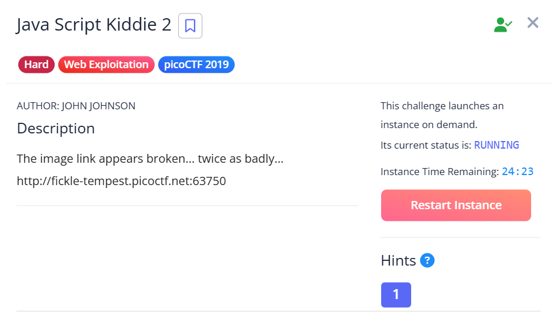
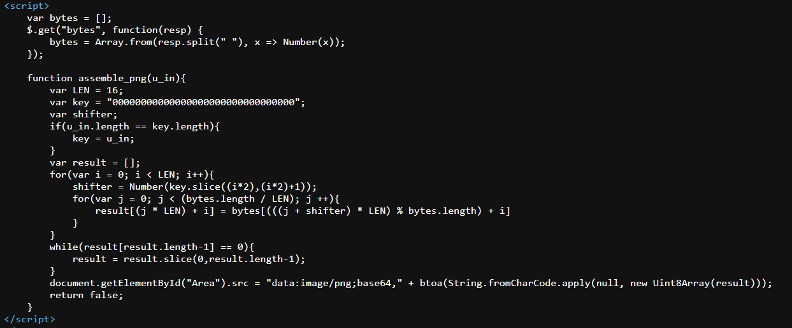
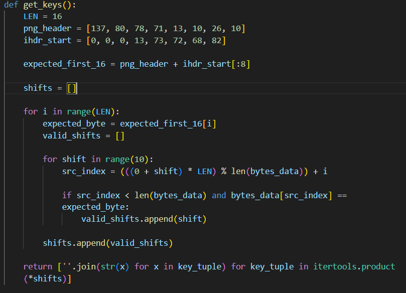
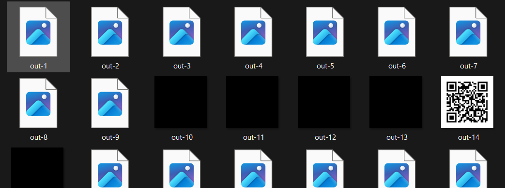
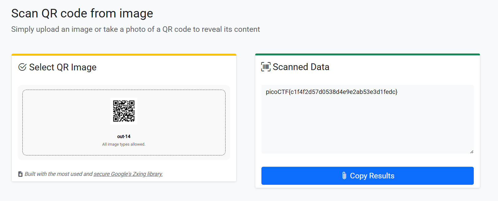

## Java Script Kiddie 2

This challenge has a similar setup to part 1, except the decryption logic seems to be slightly more complicated.  

We can still write a script to brute-force all possible key combinations using the first 16 known bytes of the expected PNG.  

Although the number of candidate keys increases significantly from part 1, one of the keys will still result in a valid QR code being generated.  

Scanning the QR code will then give us the flag.  

Flag: `picoCTF{c1f4f2d57d0538d4e9e2ab53e3d1fedc}`