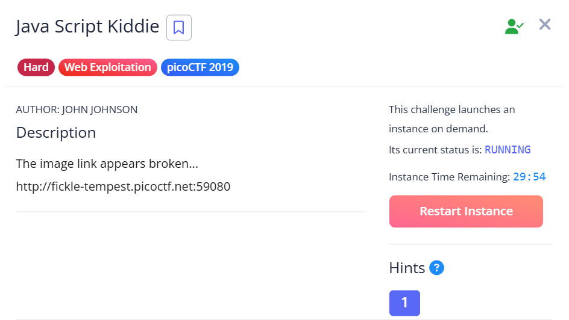
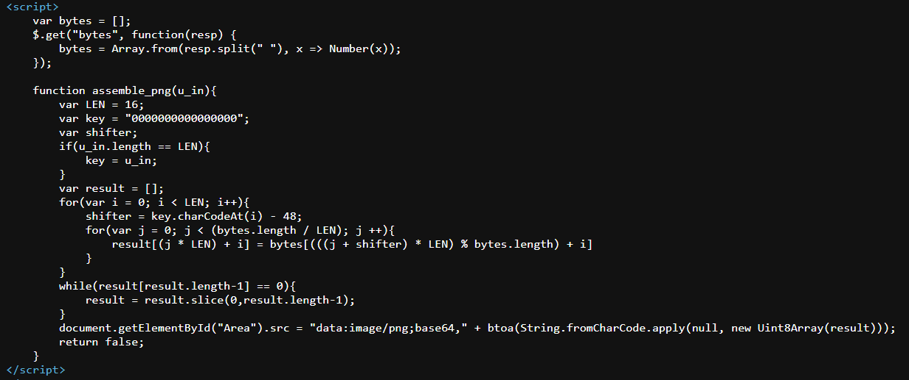
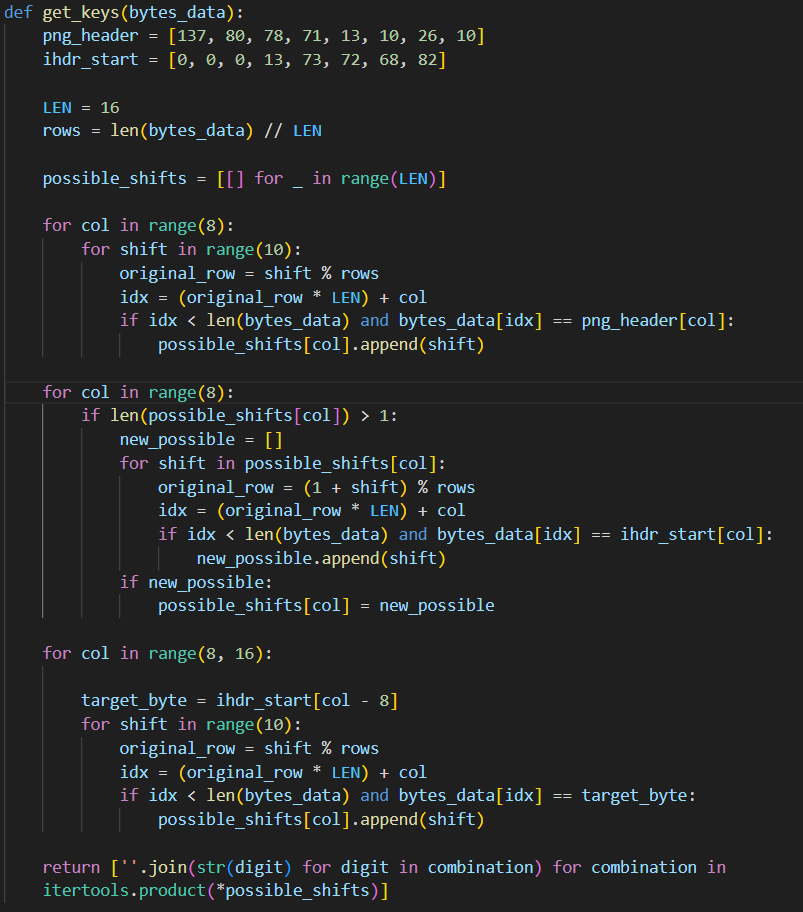
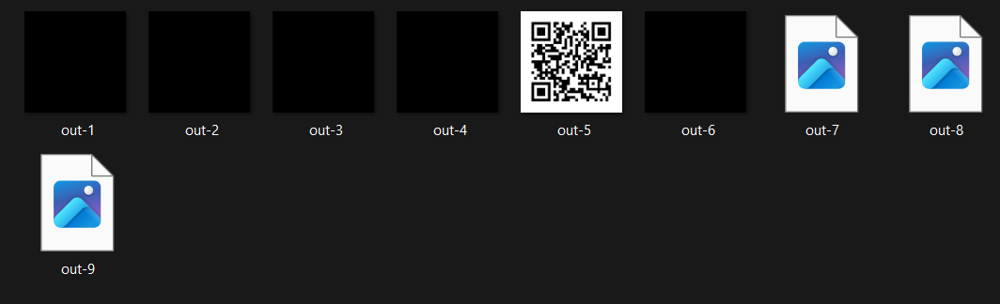
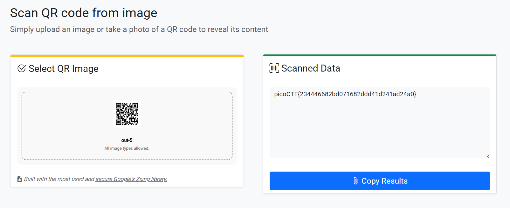

## Java Script Kiddie

We are given a minimal webpage where we have an input field.  

The webpage source code reveals that we are supposed to enter a 16-character key, upon which the webpage will fetch some bytes and use our key to decrypt and display the bytes as a PNG.  

If the key we supply is correct, we should theoretically get a valid PNG that would help us progress with the challenge.  

Since we know the first 16 bytes of the PNG image (PNG header + IHDR chunk), we can write a script to brute-force the bytes until we get all possible key combinations.  

We can then reproduce the decryption logic on our end, and one of the keys will result in a valid decryption, giving us a QR code.  

Scanning the QR code will then reveal the flag.  

Flag: `picoCTF{234446682bd071682ddd41d241ad24a0}`