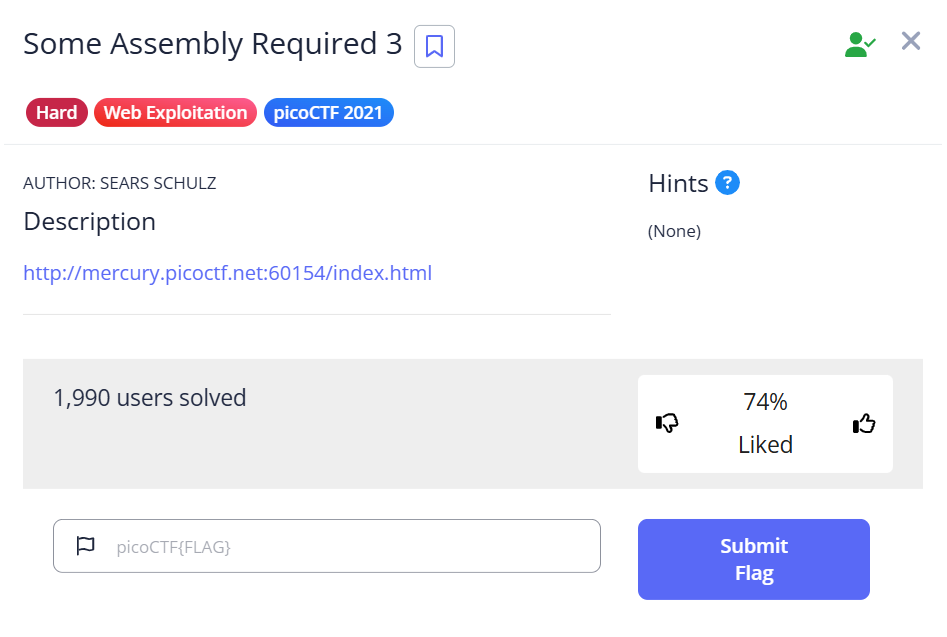
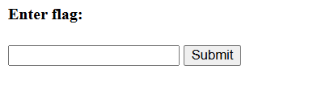
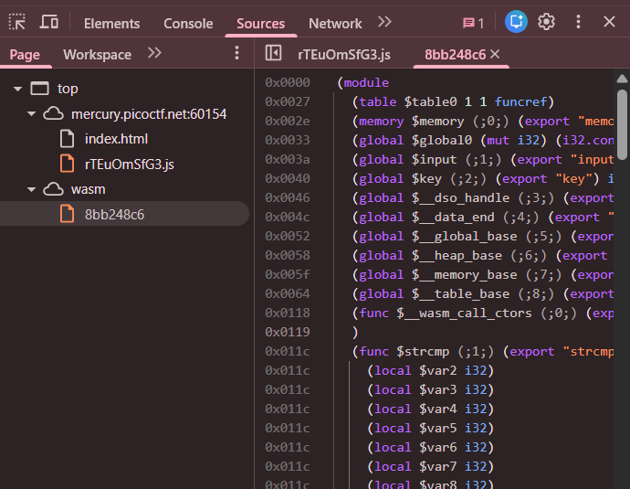
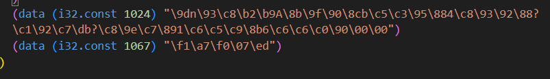
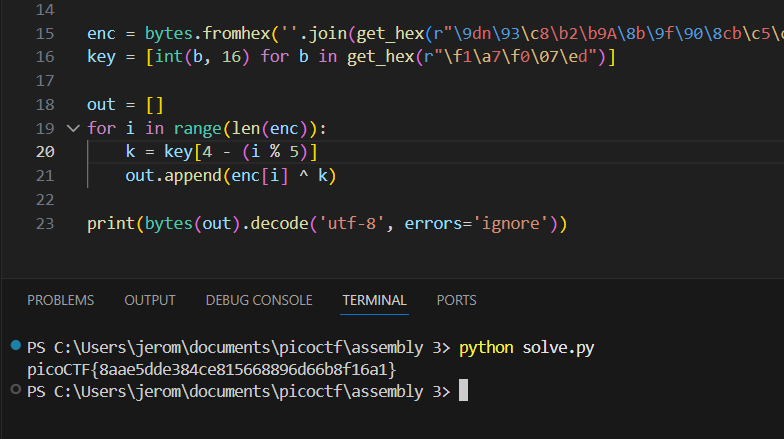

## notepad

We are given a webpage where we are supposed to enter a flag for verification.  

Opening up developer tools, we can see that the webpage uses WASM for the flag check, as hinted in the challenge name.  

The WASM code contains the encrypted flag and a decryption key. When we enter our input, the program will run an XOR decryption on the ciphertext using the key and compare our input against the decrypted flag.  

We can reproduce the decryption logic in Python to retrieve the flag.  

Flag: `picoCTF{8aae5dde384ce815668896d66b8f16a1}`