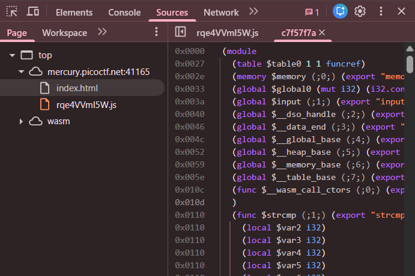
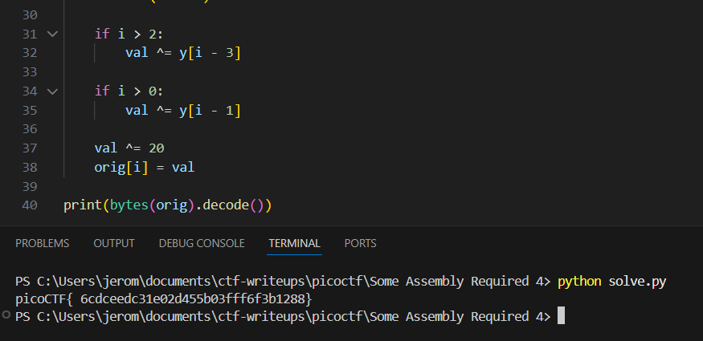

## notepad

This challenge has the same setup as part 3. Our input is run against a flag checking WASM script, but the decryption logic is more complicated this time.  

We can still reproduce the decryption logic using the hardcoded ciphertext in the WASM code to retrieve the flag.  

Flag: `picoCTF{6cdceedc31e02d455b03fff6f3b1288}`