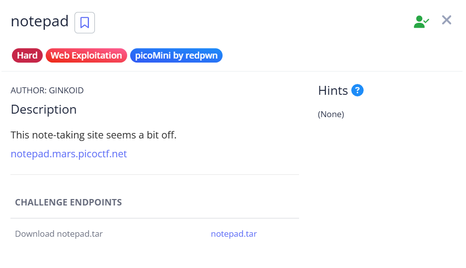
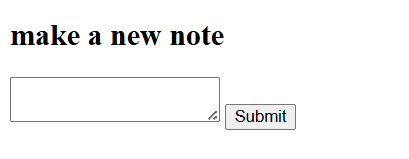
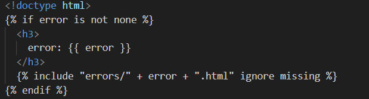
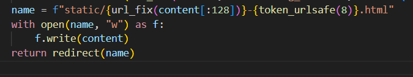
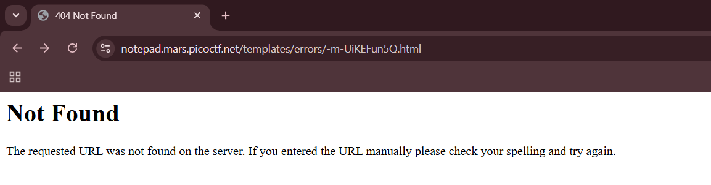
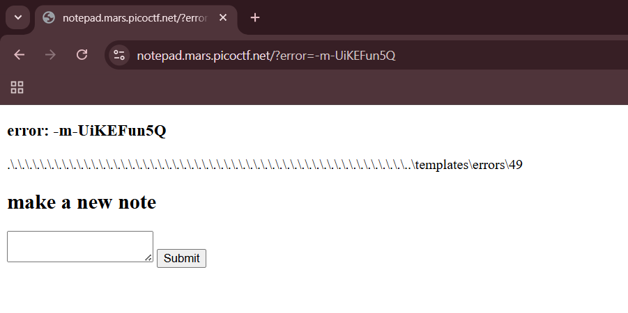
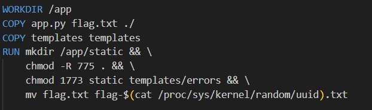
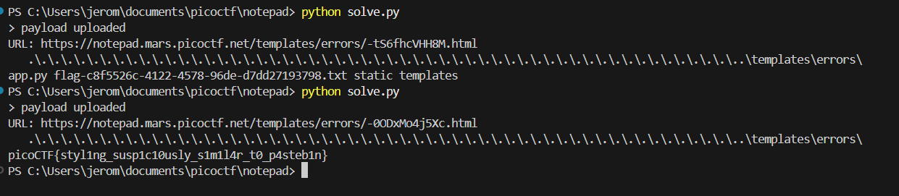

## notepad



We are given a simple webpage where we can create and display notes.  



Looking at the source code, there is a potential SSTI vulnerability in the way errors are displayed on the index page.  



There is also a path traversal vulnerability in the file writing process. If we were able to traverse into the directory with the error message templates, we can write a malicious HTML template there to gain RCE.  



Since only the first 128 characters of the filename will be sanitised by `url_fix()`, we just have to pad our payload with filler characters like `./` and the SSTI part of our payload won't be sanitised. Since we have to include the directory `../templates/error` in the filename, we just have to pad up till 108 characters.

To bypass the `/` filter, we can simply replace them with backslashes, which will be converted to forward slashes by `url_fix()`.  

```
..\templates\errors\{{7 * 7}}
```

After submitting the payload, we can retrieve the ID of our malicious template in the redirected URL.  



To trigger our SSTI payload, we simply have to visit the homepage and pass in our template ID in the `error` argument.  



The Dockerfile reveals that the flag file is stored with a randomly generated ID, hence we will have to inspect the directory structure using `os`.  



We can use a simple SSTI payload to execute and display arbitrary system commands.  

```python
{{cycler.__init__.__globals__['os'].popen('ls').read()}}
```

To bypass the `_` filter, we can use Jinja2 string formatting to obfuscate our payload.  

```python
{{cycler["%c%cinit%c%c"|format(95,95,95,95)]["%c%cglobals%c%c"|format(95,95,95,95)]['os'].popen('ls').read()}}
```

We can write a script to automate payload submissions for us. Running `ls` will reveal the filename of the flag file, which we can then read.  



Flag: `picoCTF{styl1ng_susp1c10usly_s1m1l4r_t0_p4steb1n}`