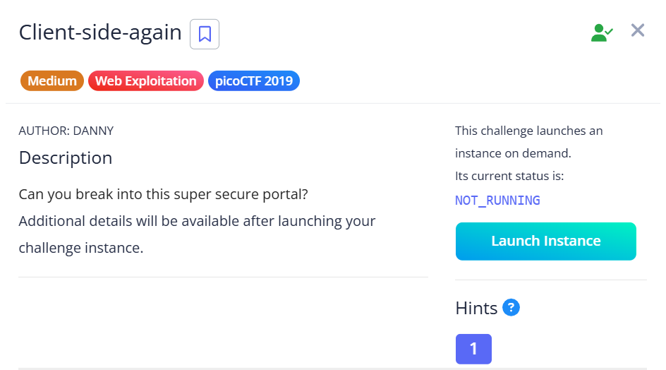
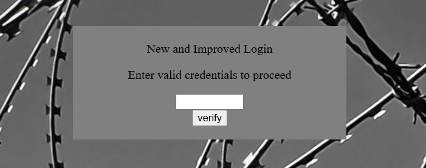
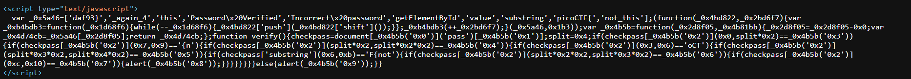
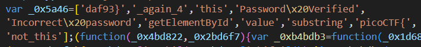

## Client-side-again

We are given a simple login page.  

Checking the webpage's source reveals some obfuscated JavaScript code.  

The flag is actually split up into parts and stored in an array at the start of the code.  

Flag: `picoCTF{not_this_again_4daf93}`