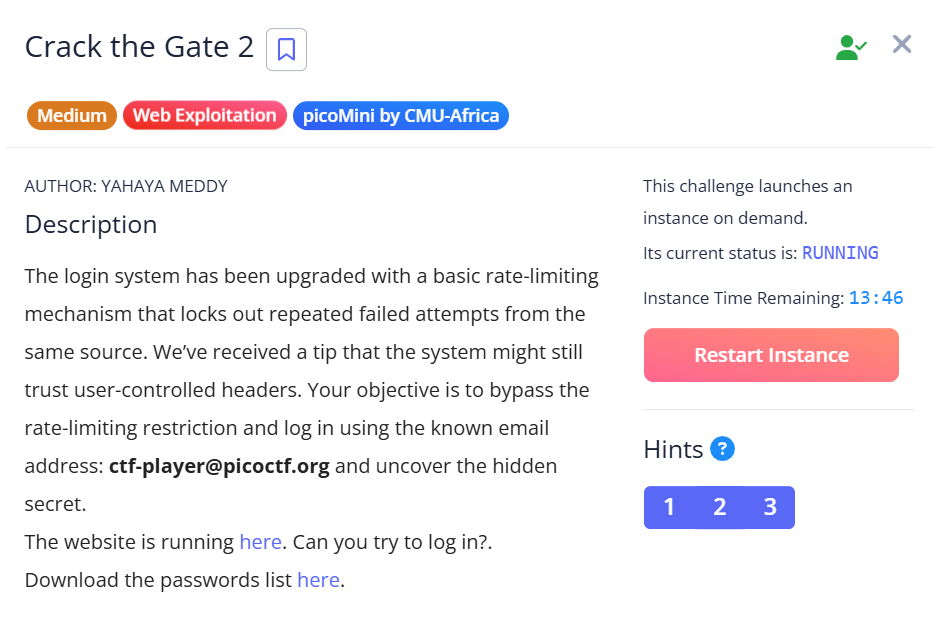
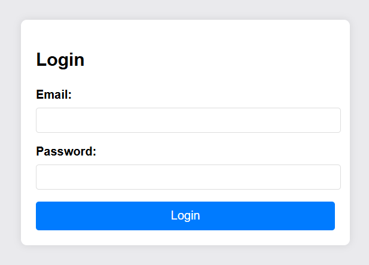
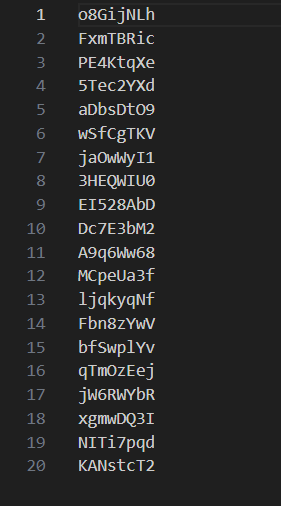
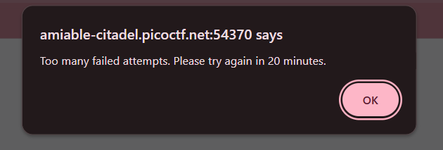
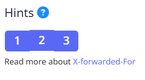
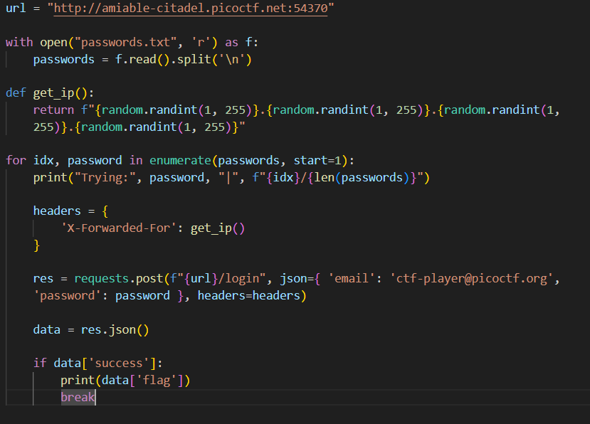

## Crack the Gate 2

We are given a simple login page with rate limiting.  

The challenge also provides us with a list of passwords to try against the login page.  

Submitting the wrong password immediately leads to us being banned for 20 minutes. Clearly, manual bruteforce isn't feasible.  

The challenge hints at us having to use the `X-Forwarded-For` header to rotate fake IP addresses for each login attempt.  

We can write a simple script to generate a random IP address each time and pass it through the `X-Forwarded-For` header, then bruteforce every password until the flag is found on the webpage.  

Flag: `picoCTF{xff_byp4ss_brut3_f6cca7d4}`