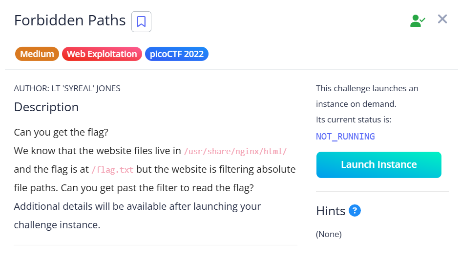
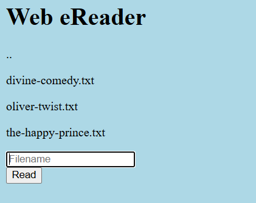

## Forbidden Paths



We are given a webpage where we can input file paths and the page will display their contents.  



Since the books are in `/usr/share/nginx/html/` and the flag is in `/flag.txt`, we can use path traversal to traverse 4 directories up and access the flag file.  

```
../../../../flag.txt
```

Doing so will display the flag.  

Flag: `picoCTF{7h3_p47h_70_5ucc355_e5a6fcbc}`