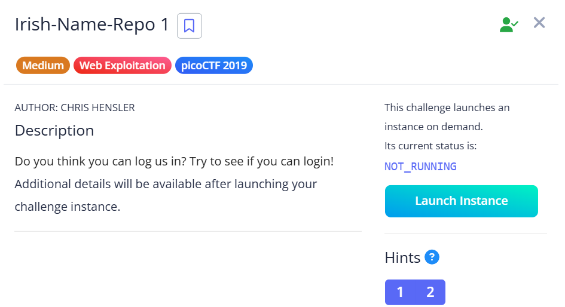
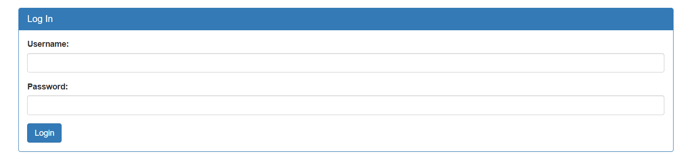
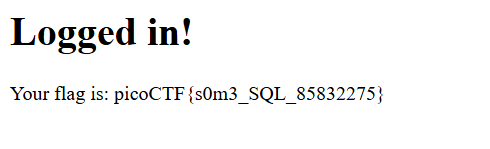

## Irish Name Repo 1



We are given a webpage that lists irish people.  


Opening the side menu reveals an admin panel we can access. We will then be redirected to a login page.  



We can bypass the login with a simple SQLi payload.  

```
username: ' or 1--
password: abc
```



Flag: `picoCTF{s0m3_SQL_85832275}`