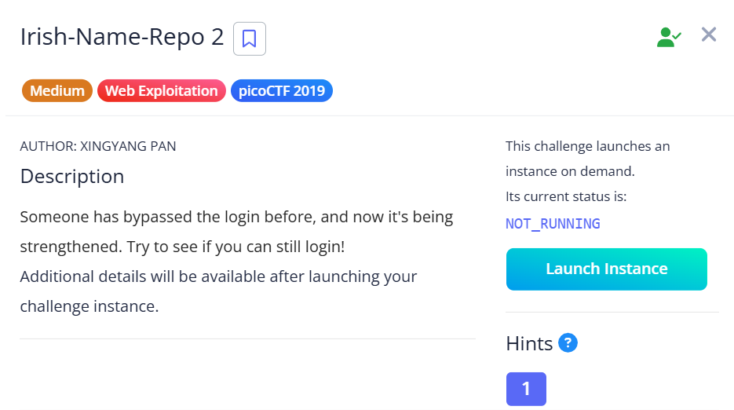
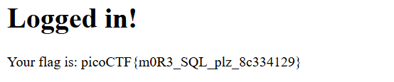

## Irish Name Repo 2



This challenge has a similar setup to part 1, except there is SQLi filtering now.  

We can still get a working auth bypass payload through trial and error.  

```
username: a' is not 'b
password: a' is not 'b
```



Flag: `picoCTF{m0R3_SQL_plz_8c334129}`