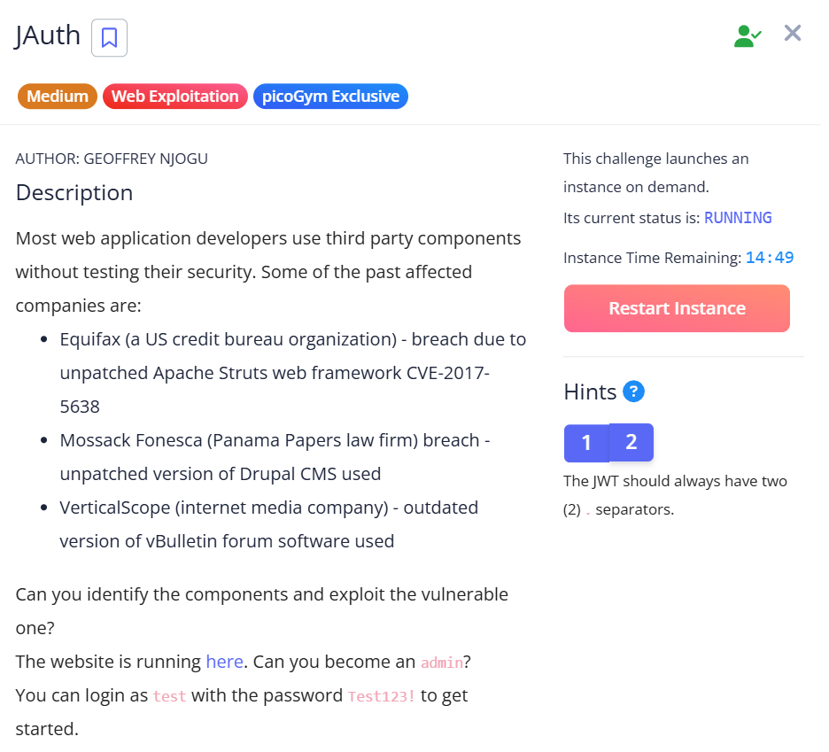
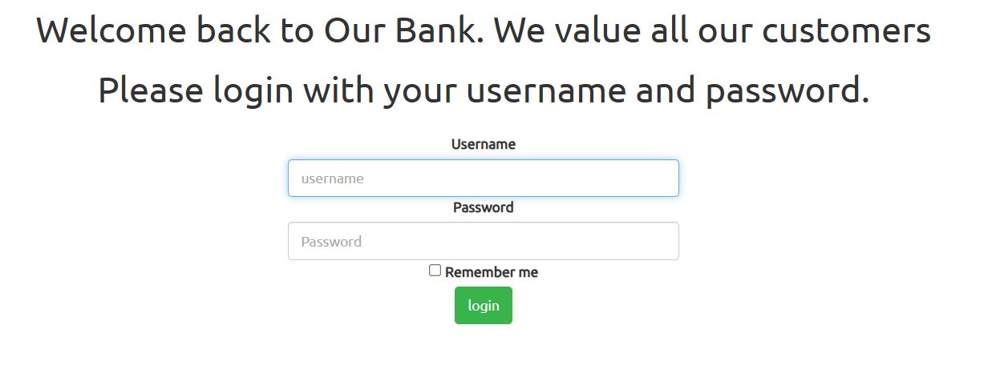
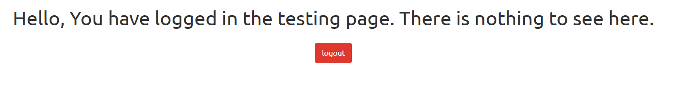
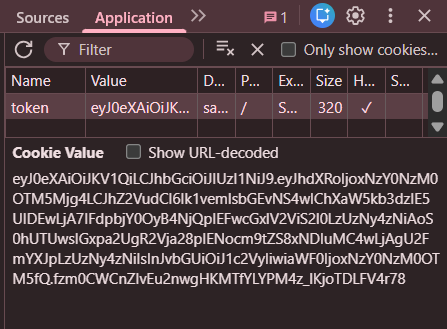
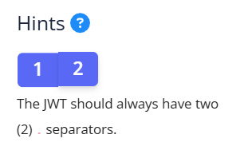
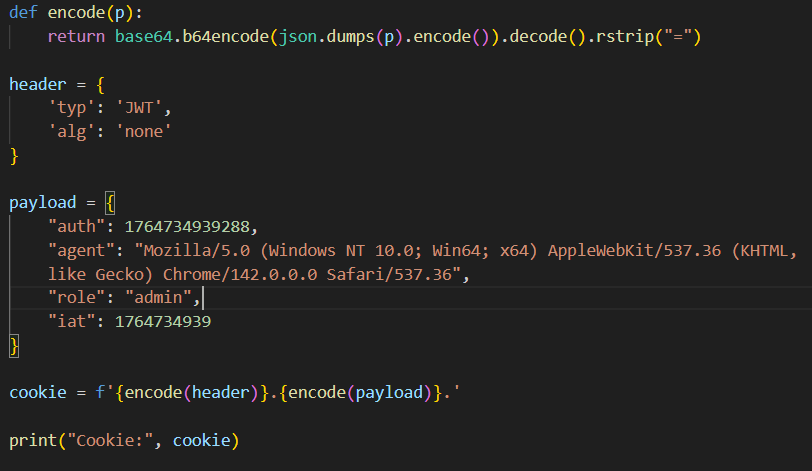
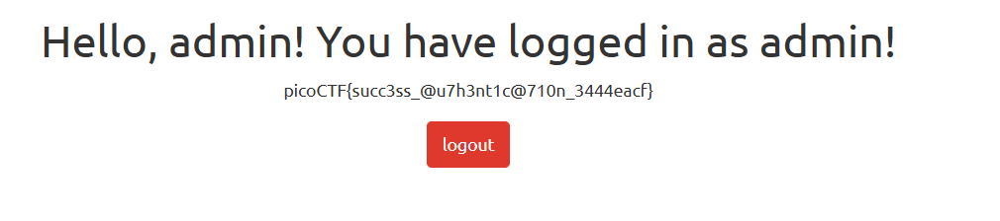

## JAuth

We are given a webpage with a simple login page.  

Upon logging in with the provided test credentials, we are redirected to an endpoint that doesn't seem very helpful.  

However, if we check the webpage cookies, we will find a JWT token.  

One of the challenge hints gives us a big clue. JWT tokens always have two `.` delimiters, and the text after the second one is the signature. This points us towards an alg none attack, where the signature is left empty, letting us bypass authentication entirely.  

To generate our malicious JWT token, we can first set the algorithm in our token header to `none`, then update our role in the token payload to `admin`.  

Changing the `token` cookie in the webpage will then display the flag.  

Flag: `picoCTF{succ3ss_@u7h3nt1c@710n_3444eacf}`