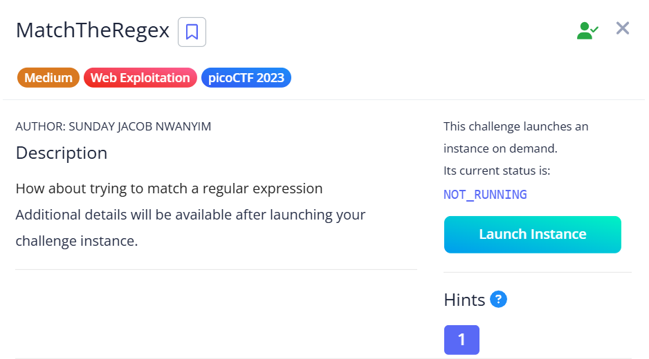
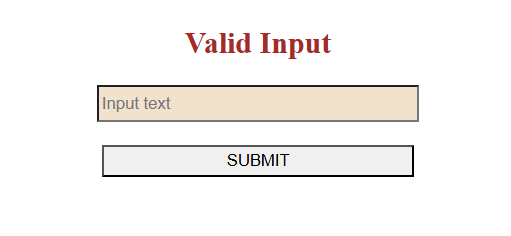
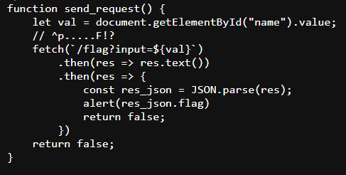
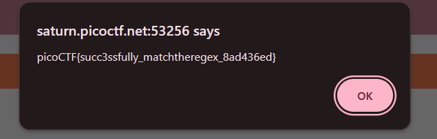

## MatchTheRegex



In the webpage provided, we are supposed to submit a valid input to reveal the flag.  



Inspecting the webpage source reveals that our input is run against a regex check. The regex pattern expects our input to start with `p`, followed by 5 arbitrary characters, then ending with `F` and an optional `!`  



We can easily craft a string that meets these requirements.  

```
p_____F
```

Submitting the string will produce an `alert` with the flag.  



Flag: `picoCTF{succ3ssfully_matchtheregex_8ad436ed}`