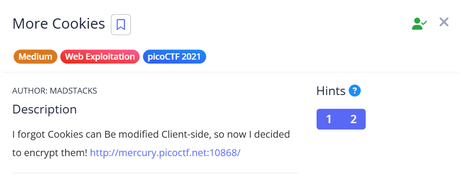
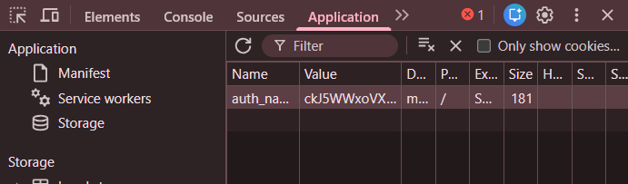

## More Cookies

fuh naw gng guessy ass chall  

uhh capitalised letters in the chall description join together to form `CBC` and this is a reference to cbc bit flipping attack apparently  

basically just get the cookie, b64 decode it twice then bruteforce each index position and flip one bit until `admin` field in the cookie becomes `1` 

then b64 encode it twice again and then submit and pray it works ig  

Flag: `picoCTF{cO0ki3s_yum_e57b2438}`