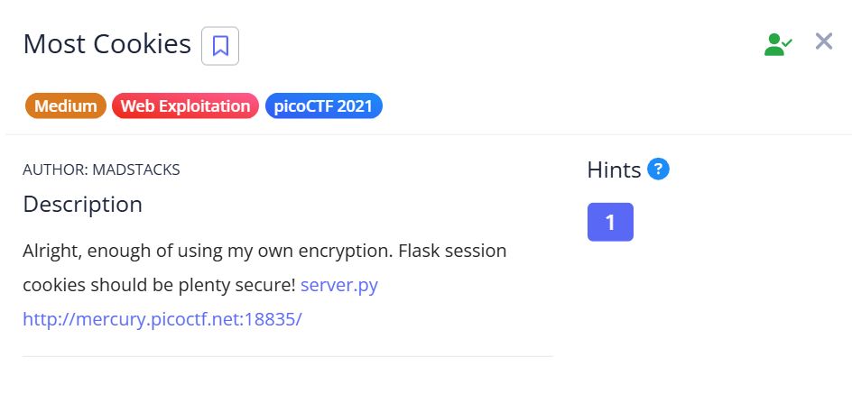
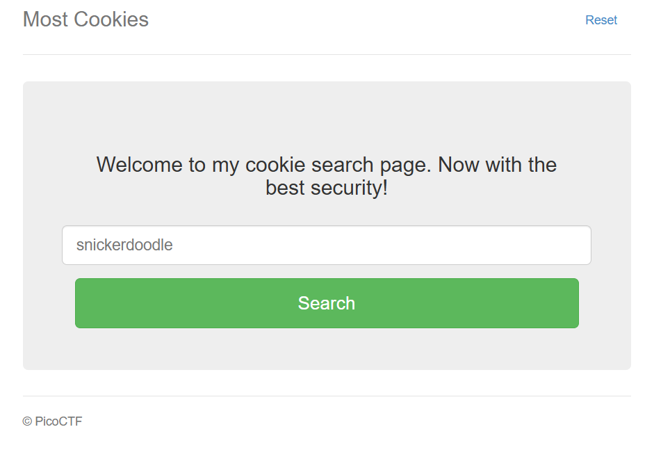
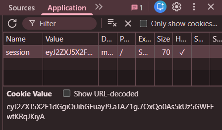
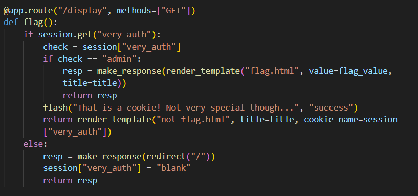
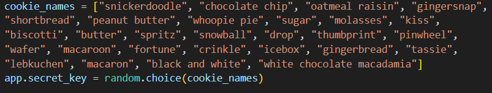
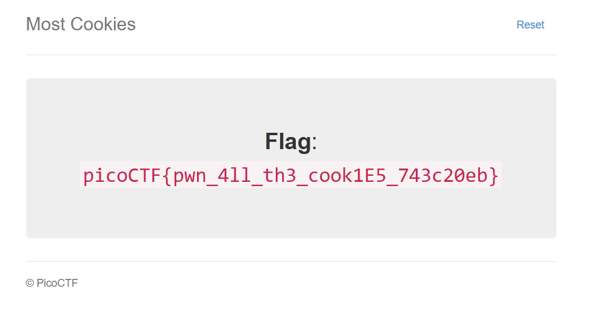

## Most Cookies



We are given a webpage that displays cookies.  



The webpage contains a flask session token in the cookies.  



In the `/display` endpoint, if we are logged in as admin, the webpage will render the flag.  



This means we have to find the secret used to sign the session token such that we can craft our own malicious token that grants us admin login.  

The webpage source code randomly picks one of the cookies to sign the token, so we thankfully don't have many options to choose from.  



We can make a custom wordlist containing the cookie names, then brute-force decode the token using `flask-unsign` in conjunction with our wordlist, revealing the cookie name used as the secret.  

```bash
flask-unsign --unsign --cookie <cookie-value> --wordlist wordlist.txt
```

We can then sign our own malicious token with admin credentials using the secret found.  

```bash
flask-unsign --sign --cookie '{"very_auth":"admin"}' --secret <secret>
```

Changing the session token in the webpage to our own token then reveals the flag.  



Flag: `picoCTF{pwn_4ll_th3_cook1E5_743c20eb}`