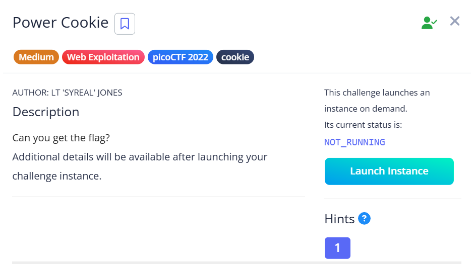
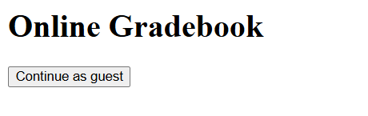
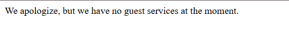
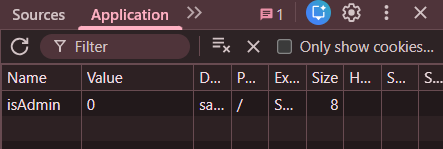
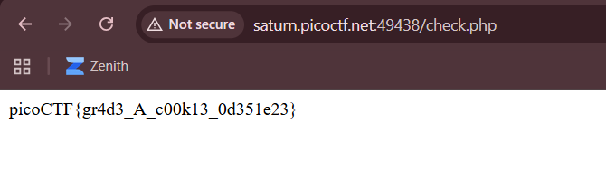

## Power Cookie

We are given a simple gradebook webpage that gives us the option to login as a guest.  

After continuing as a guest, we are redirected to a homepage with nothing interesting in particular.  

However, when we can find a cookie `isAdmin` with a value set to `0`.  

Changing the value of the cookie to `1` will give us admin privileges and display the flag.  

Flag: `picoCTF{gr4d3_A_c00k13_0d351e23}`