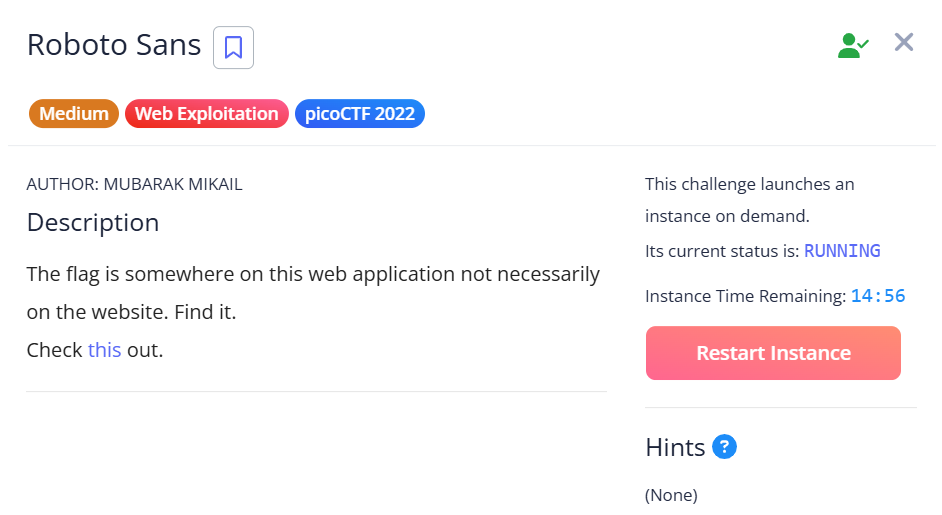
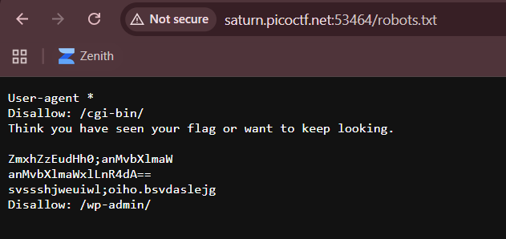
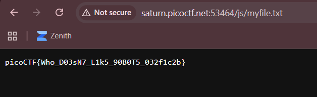

## Roboto Sans

We are provided with a webpage which we are supposed to search to find the flag.  

The challenge name heavily hints towards `robots.txt`. Visiting it reveals some hidden endpoints.  

All the endpoints are red herrings, but `anMvbXlmaWxlLnR4dA==` in the Base64 text decodes to `js/myfile.txt`.  

Viewing the file then reveals the flag.  

Flag: `picoCTF{Who_D03sN7_L1k5_90B0T5_032f1c2b}`