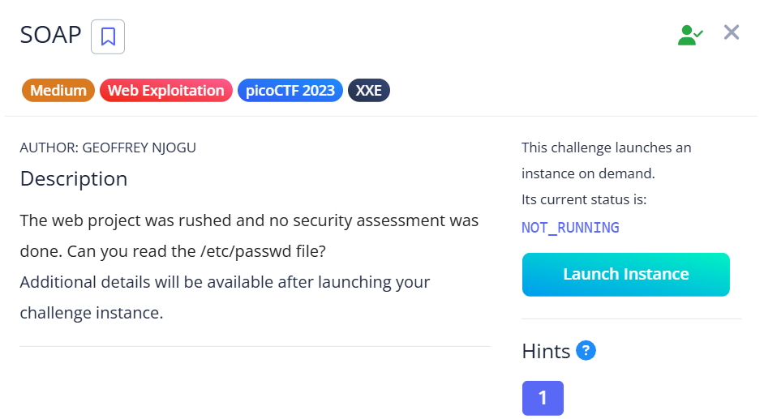
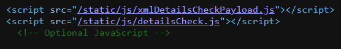
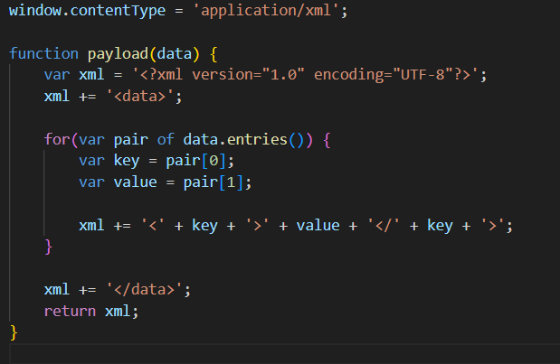
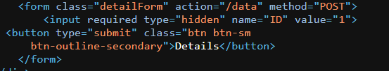

## SOAP



We are given a seemingly uninteresting webpage.  


Inspecting the webpage source code reveals two JavaScript source files, revealing that the webpage accepts XML inputs, and is hence vulnerable to XML external entity injection.      



In `xmlDetailsCheckPayload.js` we can view how the XML is constructed and displayed on the webpage. It is imperative that we follow the structure exactly such that our payload executes and displays properly later on.  

Our XML payload must start with the header shown below, and all data must be enclosed with `<data></data>` and their parameter names.  



Back in the webpage, we can see that the only field we can inject our payload in is the `ID` field, and that any XML payloads are sent to the `/data` endpoint to be processed.  



With this knowledge, we can craft an external entity injection payload that reads the `/etc/passwd` file and displays the contents in the `ID` field, as instructed by the challenge description.  

```xml
<?xml version="1.0" encoding="UTF-8"?>
<!DOCTYPE foo [ <!ENTITY xxe SYSTEM "file:///etc/passwd"> ]>
<data><ID>&xxe;</ID></data>
```

Submitting the payload to the `/data` endpoint will then display the flag.  

Flag: `picoCTF{XML_3xtern@l_3nt1t1ty_540f4f1e}`