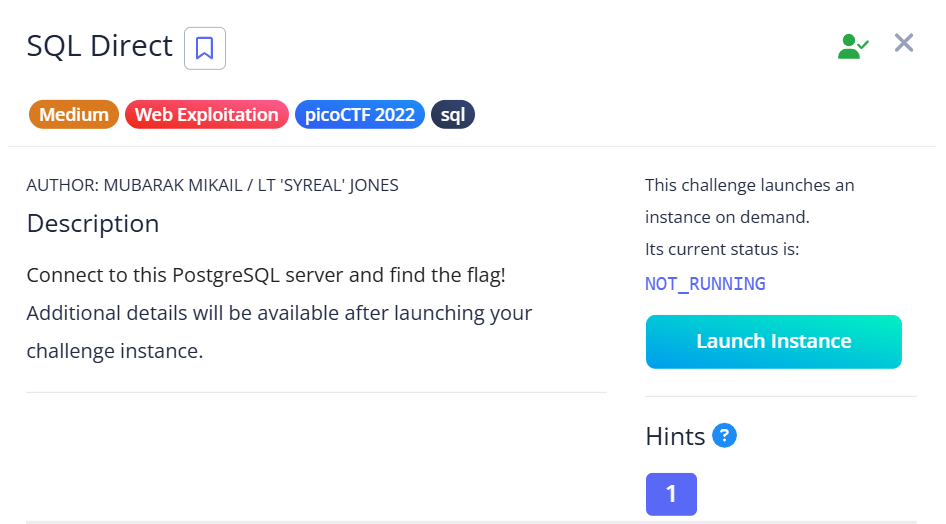
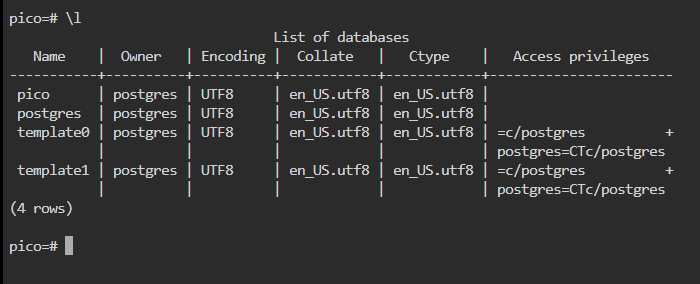
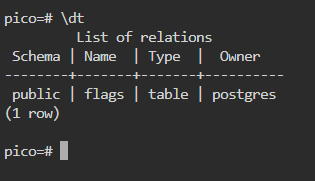
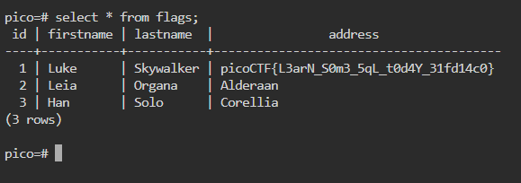

## SQL Direct  

When we first connect to the server, we can run `\l` to list the databases, and we can see that we are currently in the `pico` database.  

We can then run `\dt` to list the tables in `pico`, revealing a `flags` table.  

We can read the entries in the `flags` table with `select * from flags;`, which will give us our flag.  

Flag: `picoCTF{L3arN_S0m3_5qL_t0d4Y_31fd14c0}`