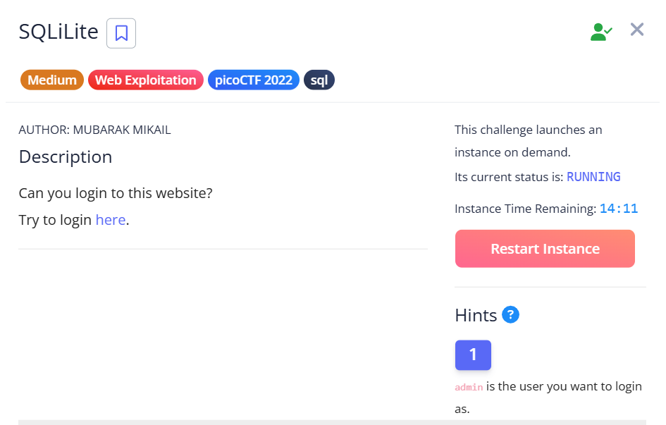
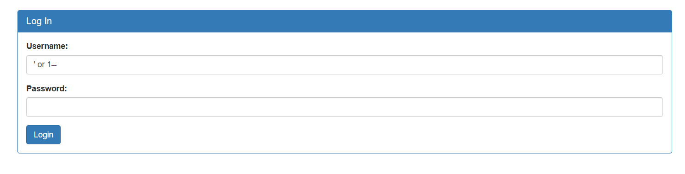
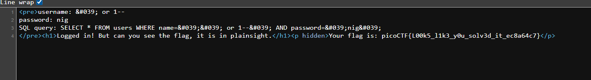

## SQLiLite



We are given a login page that is vulnerable to SQLi.  



Bypassing it is pretty trivial.  

```
Username: ' or 1--
Password: abc
```

After logging in the webpage tells us the flag is inside, but its not visible.  


We can find the flag by viewing the raw website layout.  



Flag: `picoCTF{L00k5_l1k3_y0u_solv3d_it_ec8a64c7}`