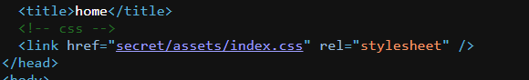
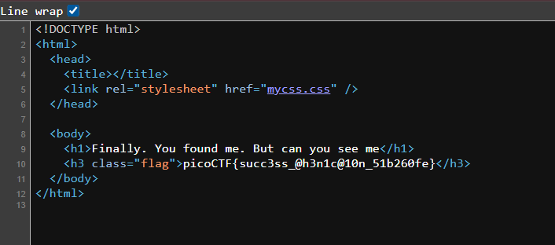

## Secrets

We are given a webpage that we are supposed to search for hidden endpoints.  

Looking at the source code, we can see a hidden directory `/secret`.  

bro im lowk lazy to explain ts shi  

basically just access `/secret/` and then just keep checking the webpage source for more hidden directories.  

the final endpoint will be `/secret/hidden/superhidden/` and then they try to hide the flag but you can view it in the webpage source

Flag: `picoCTF{succ3ss_@h3n1c@10n_51b260fe}`