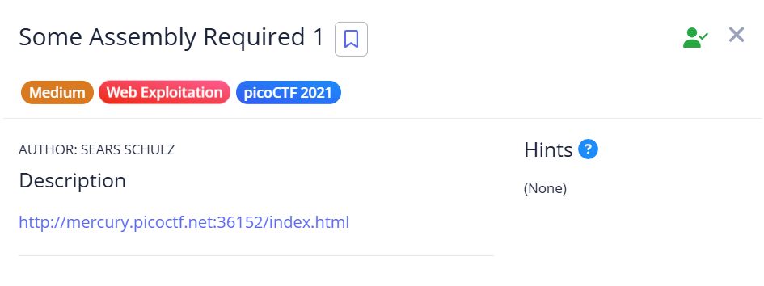
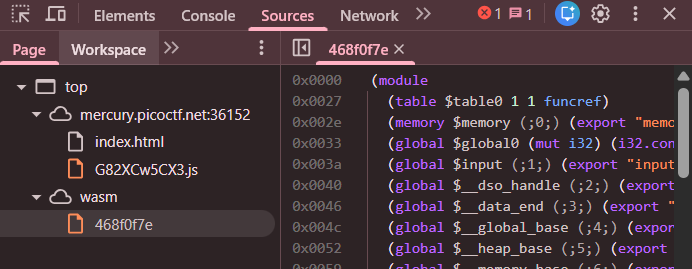
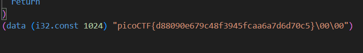

## Some Assembly Required 1

Upon accessing the webpage, we can find some WASM source code.  

We can find the hardcoded flag at the end of the WASM code.  

Flag: `picoCTF{d88090e679c48f3945fcaa6a7d6d70c5}`