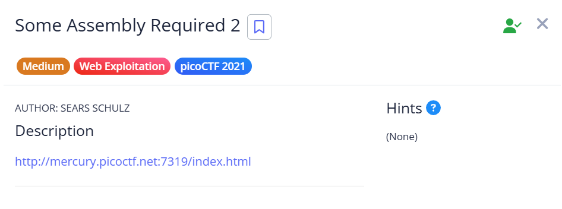
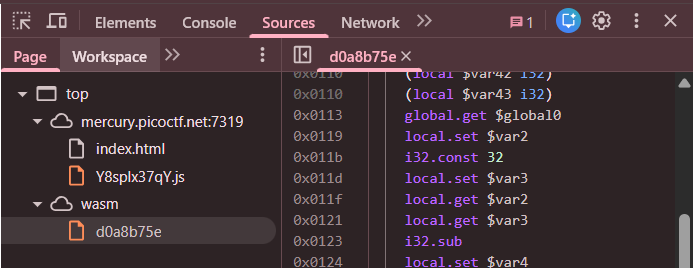
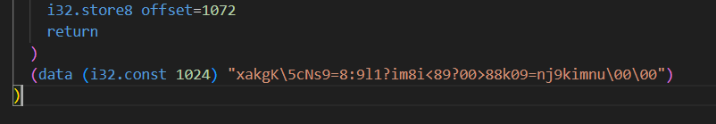

## Some Assembly Required 2



This challenge has a similar setup to part 1. We can find the WASM source code again in the webpage sources.  



This time, the flag is encrypted, and the webpage XOR decrypts it with key `8` to check against our input.  



We can easily reproduce the decryption logic using Python to retrieve the flag.  

```python
def get_hex(raw):
    enc = []
    i = 0
    
    while i < len(raw):
        if raw[i] == "\\":
            enc.append(raw[i + 1 : i + 1 + 2])
            i += 3
        else:
            enc.append(format(ord(raw[i]), '02x'))
            i += 1
    
    return enc

enc = bytes.fromhex(''.join(get_hex(r"xakgK\5cNs9=8:9l1?im8i<89?00>88k09=nj9kimnu\00\00")))

flag = ''.join([chr(b ^ 8) for b in enc])
print(flag)
```

Flag: `picoCTF{d88090e679c48f3945fcaa6a7d6d70c5}`