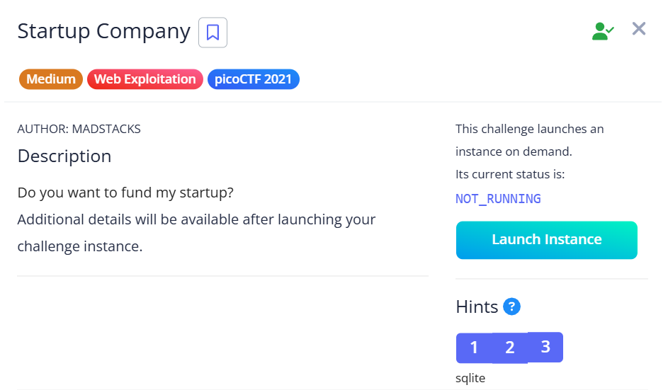
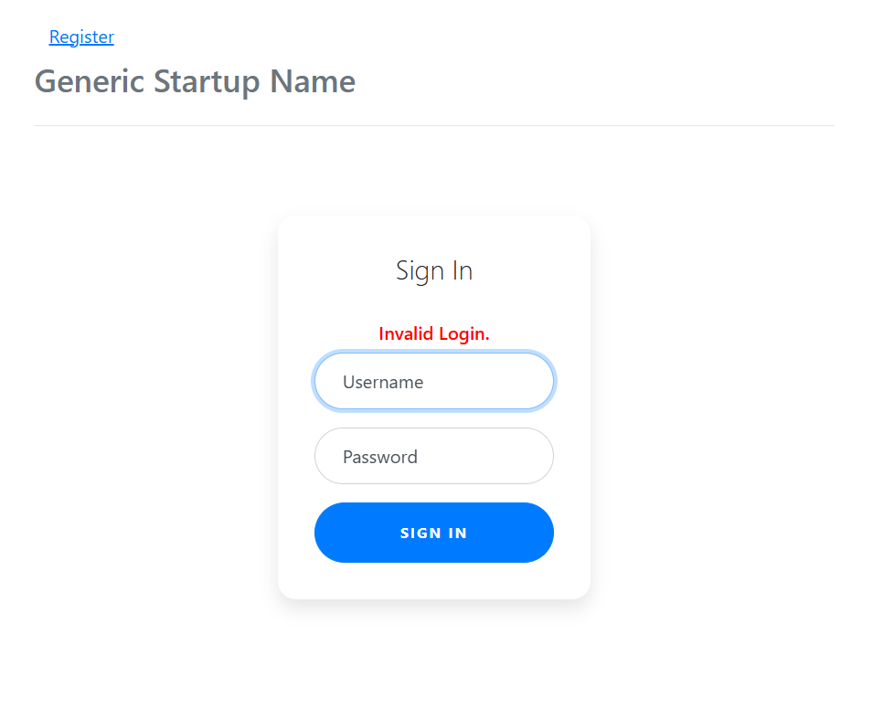
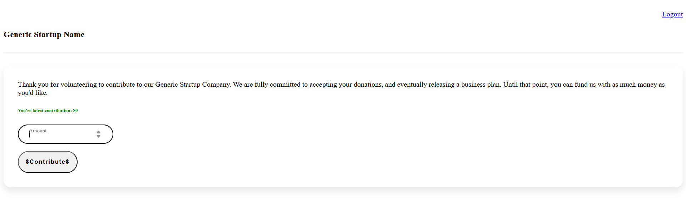
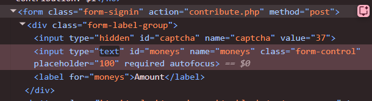
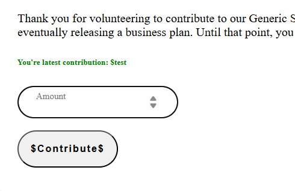
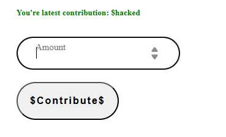
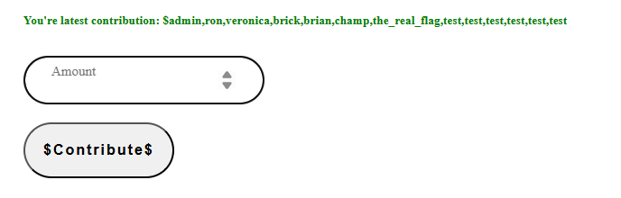
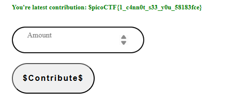

## Startup Company  



The challenge webpage first presents us with a login page. Although the challenge hint mentions the webpage using SQLite, any attempts at SQli on the login page fails, so we are forced to register a legitimate account and login.  



On the main page, we are able to contribute money through an input field.  



Since the frontend only allows us to enter digits into the input field, we can edit the input box to accept text inputs instead.  



Entering a string like `test` results in the webpage displaying it verbatim. 



This means that `moneys` is being passed as a string and there's no validation on the input at all, so there's possibly an SQLi vulnerability.  

We can deduce that the actual query probably looks something like this.  

```sql
UPDATE users SET contribution = '$moneys'
```

Entering a payload like `' || 'hacked'--` confirms the SQLi vector.  



To inspect the database structure, we can submit the following payloads.  

```sql
' || (select count(name) from sqlite_master) --
' || (select sql from sqlite_master) --
```

These reveal that there's only one table `startup_users` in the database, with the following structure.  

```sql
CREATE TABLE startup_users (nameuser text, wordpass text, money int)
```

Entering `' || (select group_concat(nameuser) from startup_users) --` will show all the users stored in the database, revealing a user `the_real_flag`.  



We can then enter `' || (select wordpass from startup_users where nameuser='the_real_flag') --` to read `the_real_flag`'s password, revealing the flag.  



Flag: `picoCTF{1_c4nn0t_s33_y0u_58183fce}`