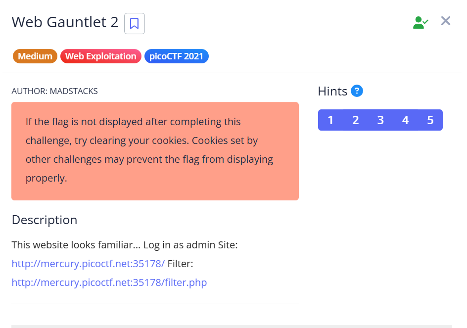
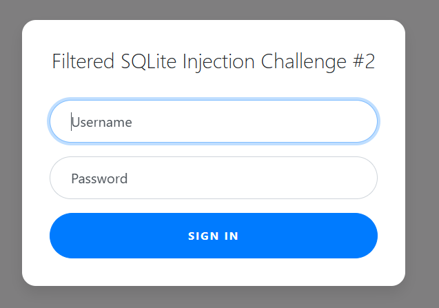
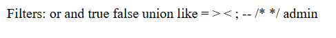
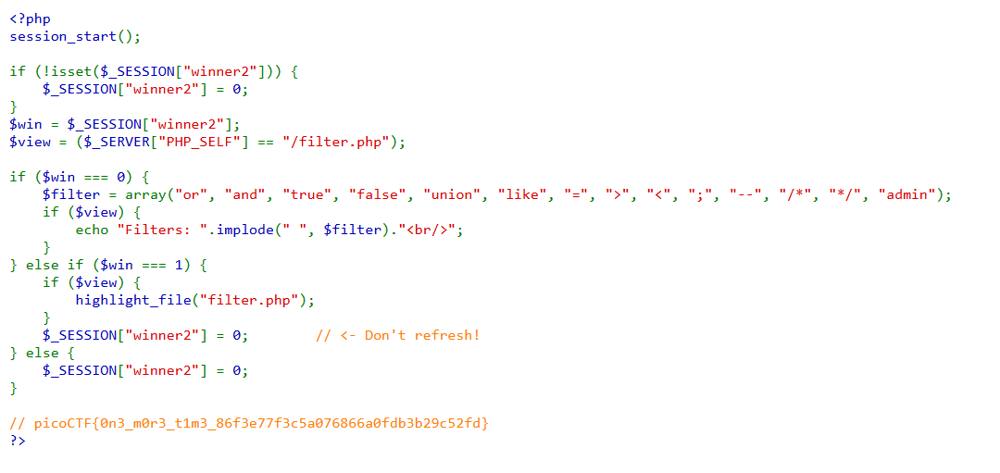

## Web Gauntlet 2



We are given a login page that is vulnerable to SQLi.  



`filter.php` also shows the exact blacklist being implemented.  



We can bypass the login with a simple SQLi payload.  

```
Username: ad'||'min
Password: a' is not 'b
```

Revisiting `filter.php` then reveals the flag.  



Flag: `picoCTF{0n3_m0r3_t1m3_86f3e77f3c5a076866a0fdb3b29c52fd}`