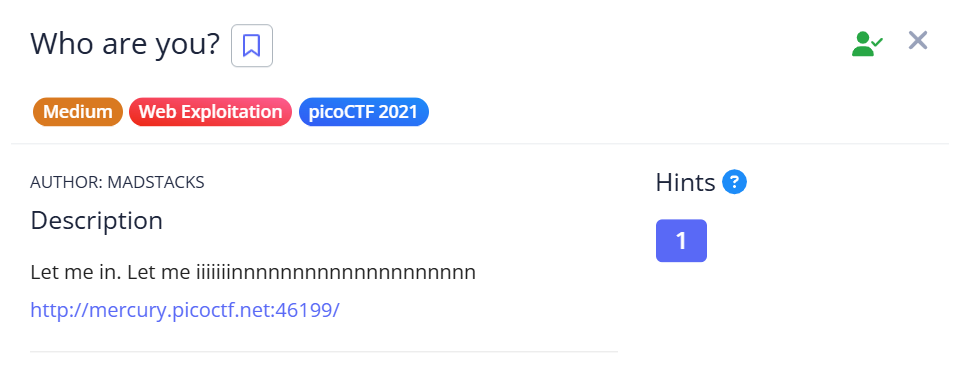

## Who are you?



uhh this chall is similar to picobrowser except theres more headers  

just use python to modify the headers in your `GET` request  

below are all the debug messages if youre missing one of the headers  

```
Only people who use the official PicoBrowser are allowed on this site!
I don't trust users visiting from another site.
Sorry, this site only worked in 2018.
I don't trust users who can be tracked.
You're in Sweden but you don't speak Swedish?
```

Flag: `picoCTF{http_h34d3rs_v3ry_c0Ol_much_w0w_8d5d8d77}`