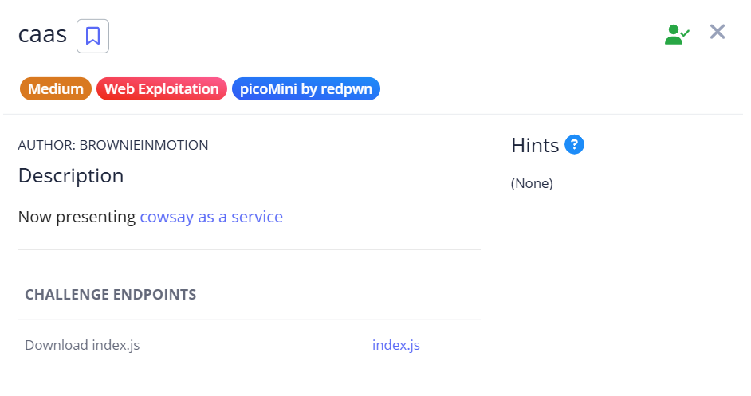
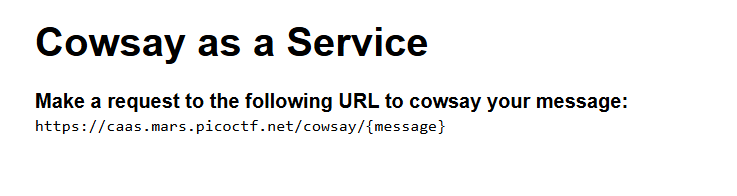
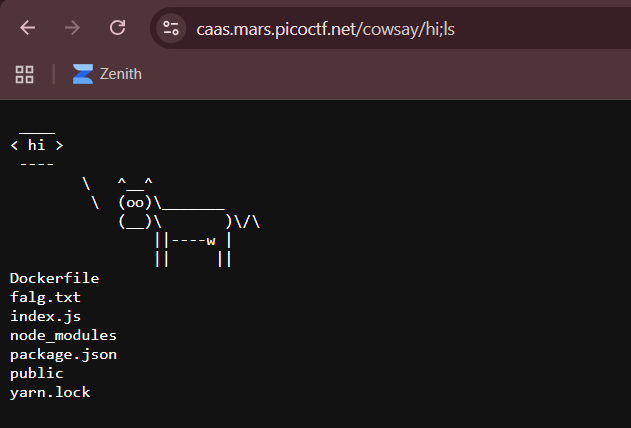
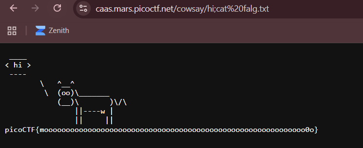

# caas

We are given a webpage that displays our message using cowsay.  

`cowsay` is a linux tool that generates ASCII art with custom messages. The webpage is most likely using the tool through `subprocess` or similar Python libraries, making it susceptible to command injection.  

We can verify this with a simple `ls` injection. We escape the current `cowsay` command with `;`, then append our actual payload at the back of the command.  

We can then read the flag at `falg.txt` using the same technique.  

Flag: `picoCTF{moooooooooooooooooooooooooooooooooooooooooooooooooooooooooooo0o}`