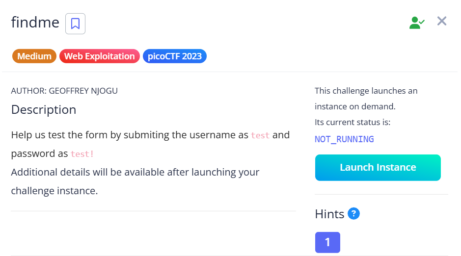
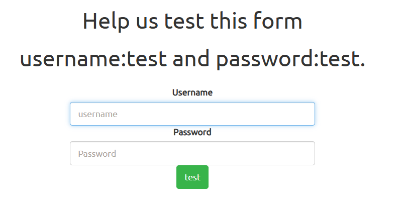
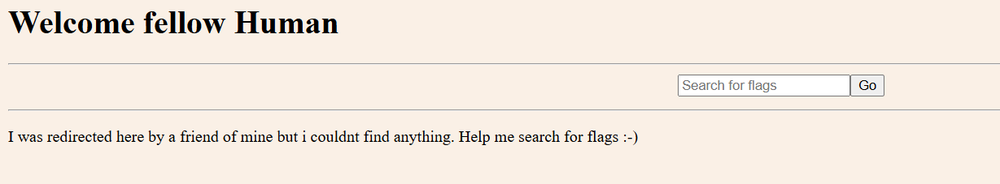
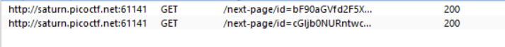

## findme

We are provided with a simple login page and some test credentials.  

Logging in with the provided credentials redirects us a few times before redirecting us to the main page. However, these redirects are too fast to catch.  

We can use BurpSuite to intercept the redirects, revealing the endpoints `/next-page/id=bF90aGVfd2F5XzNkOWUzNjk3fQ==` and `/next-page/id=cGljb0NURntwcm94aWVzX2Fs`.  

Base64 decoding both endpoints will reveal the both parts of the flag.  

Flag: `picoCTF{proxies_all_the_way_3d9e3697}`