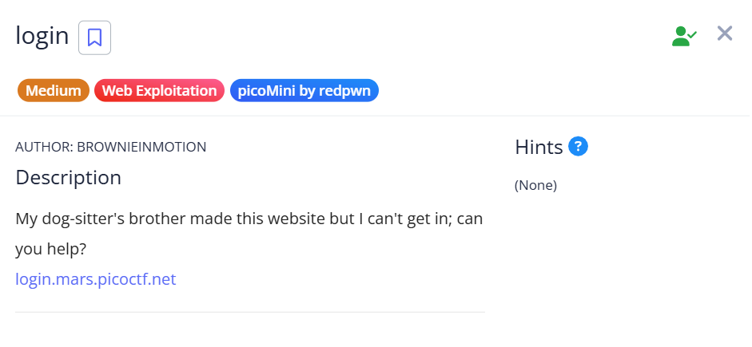
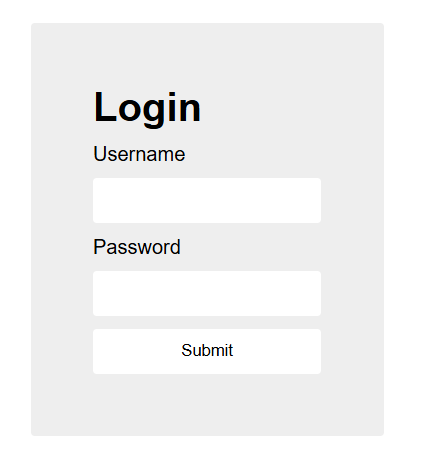
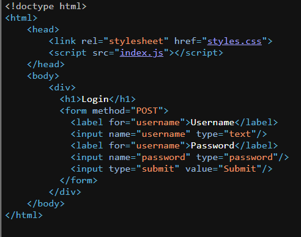
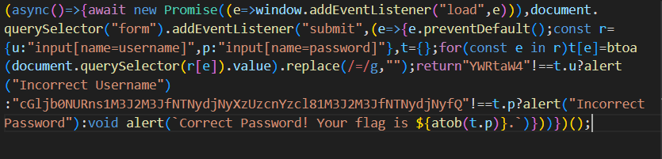

## login

We are given a very minimal login page.  

Checking the webpage source reveals an `index.js` file.  

`index.js` actually contains the logic that handles the login authentication.

We don't actually have to reverse engineer the entire code, as the Base64 string `cGljb0NURns1M3J2M3JfNTNydjNyXzUzcnYzcl81M3J2M3JfNTNydjNyfQ` in the code decodes to the flag.  

Flag: `picoCTF{53rv3r_53rv3r_53rv3r_53rv3r_53rv3r}`