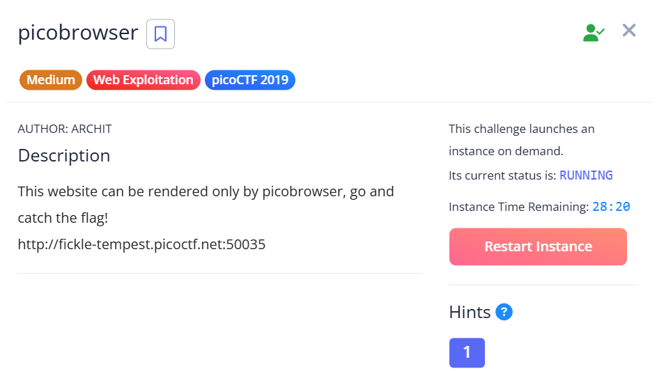
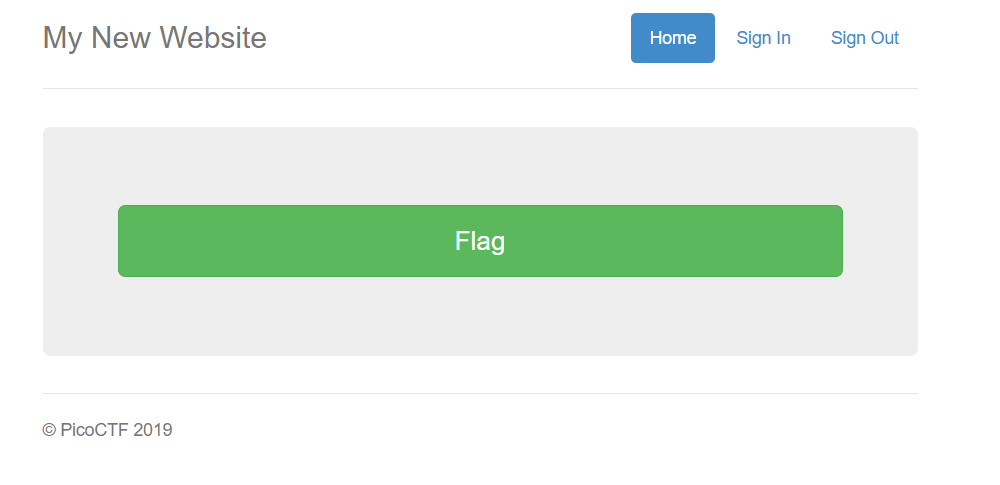
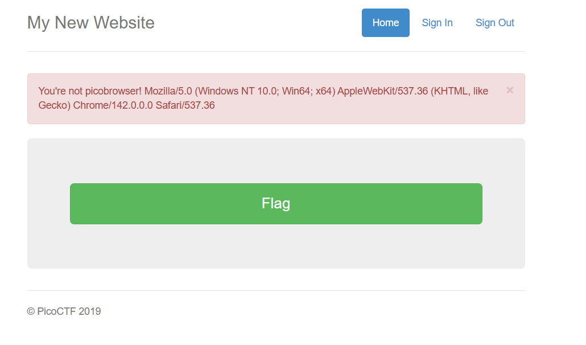

## picobrowser



We are given a webpage that contains a flag endpoint.  



However, when we access the flag endpoint, we get an error message saying we are not `picobrowser` and also displaying our browser.  



This probably means that we have to modify our request such that we can be identified as `picobrowser`. We can achieve this by changing the `User-Agent` header in our request.  

```python
import requests
import re

url = "http://fickle-tempest.picoctf.net:50035"

res = requests.get(f'{url}/flag', headers={ 'User-Agent': 'picobrowser' })

print(re.findall(r'(picoCTF{.+})', res.text)[0])
```

Flag: `picoCTF{p1c0_s3cr3t_ag3nt_fba5c48f}`